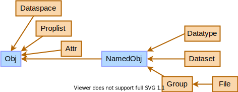

*************************************
IO Module
*************************************

.. include:: /global.rst

.. namespace:: HIPP::IO::H5

.. _api-io-usage:

The IO module of HIPP provides 

- High-level, pure-OOP wrappers for the HDF5 library.
- Extentions to simplify common I/O tasks.
- Intermediate-level components that are mapped to the actual HDF5 library calls.

.. _api-io-h5-objects:

High-level HDF5 Objects 
--------------------------

The basic high-level HDF5 objects are :class:`Dataspace`, :class:`Proplist`, :class:`Attr`,
:class:`Datatype`, :class:`Dataset`, :class:`Group`, and :class:`File`. 

Among them, :class:`Datatype`, :class:`Dataset`, :class:`Group`, and :class:`File` 
are "named objects" that can be stored in files and connected by links.
Addionally, a :class:`File` object can be used where a  :class:`Group` object 
is needed (the "root" group is implicitly used by the library).

To reflect the logic relations of those objects, HIPP adopts the following inheritance
graphs of them:

.. _fig-api-io-h5-inheritance:

    The inheritance of HIPP HDF5 objects. :class:`Obj` and :class:`NamedObj` are 
    two abstract object types that do not have actual related HDF5 resources.

The inheritance has strong impact on how the APIs of those objects are used.
For example:

- :class:`File` inherits all methods from :class:`Group`. Hence, you can create links, 
  extract meta-info of them, visit/iterate links and sub objects, create/open datasets, 
  from a :class:`File` instance. These operations are applied to the 
  root group of the file instace.
- :class:`Datatype`, :class:`Dataset`, :class:`Group`, and :class:`File` inherit 
  all methods from :class:`NamedObj`. Therefore, they can create/open attributes 
  and iterate over them, by using the API defined in :class:`NamedObj`.
- All of these types are sub class of :class:`Obj`. Hence, the memory management API
  defined in :class:`Obj`, such as :expr:`Obj::raw()`, :expr:`Obj::free()`, and
  :expr:`Obj::has_referenced()` can be used on instance of any HDF5 type.

However, some different methods that have the name do appear (static bind) both 
in the sub class and the parent class. For example:

- Each class defines its own version of ``obj_raw()`` which returns a referene 
  to intermediate-level HDF5 object counterpart. Therefore, ``file.obj_raw()``
  returns :expr:`_File &`, while ``file.NamedObj::obj_raw()`` returns 
  :expr:`_NamedObj &`.
- :class:`Group` and :class:`NamedObj` both has its own version of ``get_info()``,
  which returns the group meta-info and object-meta info, respectively.
  Hence, ``group.get_info()`` returns the group meta-info of the instance,
  while ``group.NamedObj::get_info()`` returns its meta-info as a named object.
  To simplify the usage,
  we do provide a method :expr:`Group::get_object_info()` which has the same 
  effect of the later call.

List of High-level Components
------------------------------

.. table::
    :class: tight-table

    ==================================================================== ====================================================== ====================================================
    Class                                                                Corresponding HDF5 Standard C API                      Details
    ==================================================================== ====================================================== ====================================================
    :class:`File`                                                        H5F                                                    File manipulation.
    :class:`Group`                                                       H5G, H5L                                               Data group operations.
    :class:`Dataset`                                                     H5D                                                    Dataset operations.
    :class:`Datatype`                                                    H5T                                                    Type system.
    :class:`Dataspace`                                                   H5S                                                    Dataspace operations.
    :class:`Proplist`                                                    H5P                                                    Property list.
    :class:`Attr`                                                        H5A                                                    Attributes.
    :class:`Obj`
    :class:`NamedObj`                                                    H5O                                                    Base class of all HDF5 objects.
    :class:`XTable`                                                                                                             Base class of all named HDF5 objects.
    :class:`Dimensions`         
    :class:`Points`
    :class:`Chunk`
    :class:`Hyperslab`
    :class:`Datapacket`, :class:`ConstDatapacket`                                                                               Convert C++ object to H5 datatype and dataspace.
    :class:`DatapacketScalar`, :class:`ConstDatapacketScalar`                                                                   Scalar versions of ``Datapacket``.
    :class:`DatapacketStr`, :class:`ConstDatapacketStr`                                                                         String versions of ``Datapacket``.
    ==================================================================== ====================================================== ====================================================

High-level API 
---------------

.. toctree::
    :maxdepth: 2

    high-level/global-def
    high-level/obj
    high-level/file 
    high-level/dataset 
    high-level/attr
    high-level/error
    high-level/util

Extended API 
--------------

.. toctree::
    :maxdepth: 2

    ext/tabular

Intermediate-level API
------------------------

.. toctree::
    :maxdepth: 2

    intermediate-level/datatype

