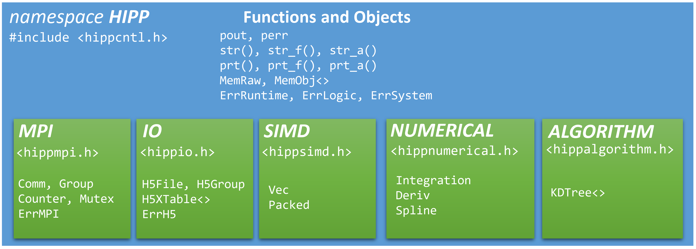

Quick Start
=====================

.. include:: /global.rst

The Overall Structure and Conventions of HIPP
-----------------------------------------------

.. _hipp-namespace:

HIPP's functions/objects are defined in a single **namespace** ``HIPP``. Depending on the module to use,
you may need to include different **header files** and visit sub-namespaces. See :numref:`fig-hipp-namespaces`
for a summary.

-   The general C++ utilities are defined directly in namespace ``HIPP``. 
    Users include the header ``<hippcntl.h>`` for access to them,
    e.g., the :func:`HIPP::prt` function and the :class:`HIPP::ErrLogic` class.
-   For each module X, there is a single sub-namespace ``HIPP::X``. User include the header ``<hippx.h>`` to use them. 
    For example, to use the communicator class in the MPI module, include ``<htppmpi.h>``
    and define :class:`HIPP::MPI::Comm` instances.

.. _hipp-naming-convention:

HIPP uses an ordinary **naming conventions** for definitions:

-   Namespaces are capitalized. For example: 
    
    - The global namespace ``HIPP``
    - The sub-namespace ``MPI``, ``IO``, ``SIMD``.

-   C++ ``class/struct`` uses CamelCase convention, with the first letter capitalized. For example: 
    
    - The MPI group class :class:`HIPP::MPI::Group`.
    - HDF5 file class :class:`HIPP::IO::H5File`.
    - Logic exception type :class:`HIPP::ErrLogic`.

-   Functions, (class) methods and variables are lower case. For example: 
    
    - The printing function :func:`prt`. 
    - The dataset creation method in a HDF5 file class :func:`HIPP::IO::H5File::create_dataset`.

-   Constant variables (``const`` or ``constexpr``) are capitalized, except for special cases. For example: 

    - The MPI float datatype :var:`HIPP::MPI::DOUBLE`.
    - The HDF5 dataspace class for scalar :enumerator:`HIPP::IO::H5Dataspace::SCALAR_C`.

.. _fig-hipp-namespaces:

    **Header files and namespaces.**
    All HIPP utilities are defined
    in the namespace ``HIPP``. Functions/objects in a module are defined in the sub-namespace.

Using HIPP: A Minimal Example  
-----------------------------------------------------------------
:download:`quick-start/printing.cpp <../../../example/quick-start/printing.cpp>`

.. include:: ../../../example/quick-start/printing.cpp 
    :code:  cpp

To use HIPP general-purpose C++ utilities, include the header ``<hippcntl.h>``. HIPP provides
several stream manipulation classes and functions. 

-   The "pretty" stream, :var:`pout <HIPP::pout>`, is just like ``std::cout``,
    but it accepts comma separated arguments, so that the code for printing is more concise.
-   The printing function :func:`prt_a <HIPP::prt_a>` prints an array of elements into a std stream.
-   The string constructing functions :func:`str <HIPP::str>` and :func:`str_a <HIPP::str_a>` construct
    ``std::string`` from a series of arguments and an array of elements, respectively.

To compile, link the library :bash:`hippcntl`. Execution would be the same as an usually executable.

.. code-block:: bash 

    c++ -std=c++17 -O3 -Wall  -o printing.out printing.cpp -lhippcntl
    ./printing.out 

The output for this simple example is:

.. code-block:: text 

    The sum of 1 and 2 is 3
    1,2,3,4,5
    The sum of 1 and 2 is 3
    1,2,3,4,5

Using the MPI Module
-------------------------------
:download:`quick-start/p2p-comm.cpp <../../../example/quick-start/p2p-comm.cpp>`

.. include:: ../../../example/quick-start/p2p-comm.cpp 
    :code:  cpp

HIPP's MPI module provides full-OOP interface for the message passing programming. First, include the 
header ``<hippmpi.h>``
To initialize the MPI environment, just define a named variable of type :class:`Env <HIPP::MPI::Env>`.
As opposed to the standard MPI calls ``MPI_Init()`` and ``MPI_Finalize()``, such a OOP way 
is both simpler and safer, because the finalization call is automatically made on the 
destruction of the :class:`Env <HIPP::MPI::Env>` object - you have no change to forget it.

To make point-to-point communication, just get a "world" communicator from the :class:`Env <HIPP::MPI::Env>` object.
It has a type :class:`Comm <HIPP::MPI::Comm>`, but the easiest way is to use an ``auto`` to let the compiler
determine its type. Then, calling the :func:`send <HIPP::MPI::Comm::send>` and :func:`recv <HIPP::MPI::Comm::send>`
methods of it to make communication. In this example we send an array of five elements from Process 0 to Process 1.

To compile, link the library :bash:`hippcntl` and :bash:`hippmpi`, and use proper MPI compiler wrapper 
(e.g. :bash:`mpicxx`). 
Execution would be the same as other MPI applications - just use :bash:`mpirun` or :bash:`mpiexec`.

.. code-block:: bash 

    mpicxx -std=c++17 -O3 -Wall -o p2p-comm.mp.out p2p-comm.cpp -lhippmpi -lhippcntl
    mpirun -n 4 ./p2p-comm.mp.out

The output for this example is:

.. code-block:: text 

    1,2,3,4,5

Using the IO Module 
------------------------------------
:download:`quick-start/io-arrays.cpp <../../../example/quick-start/io-arrays.cpp>`

.. include:: ../../../example/quick-start/io-arrays.cpp 
    :code:  cpp

IO as the HDF5 format is extremely easy with HIPP. First, include the header ``<hippio.h>``
To create a new file of HDF5 format, just 
define a variable typed :class:`H5File <HIPP::IO::H5File>` with a desired file name and the ``"w"``
mode (truncate the file if existing).

To write a single array dataset of numeric type, just create a new dataset by method 
:func:`create_dataset <HIPP::IO::H5File::create_dataset>`. The template parameter
specifies the element type in file (``double`` here), the two arguments are 
the name of the dataset and the shape of the array (1-d array of 32 elements here).
Then, a call of :func:`write <HIPP::IO::H5Dataset::write>` on the dataset instance outputs
the data in a buffer (a ``std::vector`` or a raw buffer) to the file.

To write tabular data (array of use-defined ``struct``, like the ``Person`` here), 
HIPP provides an easy-to-use 
extension class :class:`H5XTable <HIPP::IO::H5XTable>`. 
If all the members in the struct 
are numeric types (or their fixed-length raw array, like ``char[32]`` and ``int [3][4]``),
:class:`H5XTable <HIPP::IO::H5XTable>` can deal with it. 
You just define a 
:class:`H5XTable <HIPP::IO::H5XTable>` instance, use the arguments to specify 
the name of each member and the member pointer to it. Then, a single call 
of :func:`write <HIPP::IO::H5XTable::write>` outputs an array of the struct data 
to a group in the file, each member as a separate dataset.
Or, you may use the call :func:`write_records <HIPP::IO::H5XTable::write_records>`
to output them as a single dataset of compound datatype.

To compile, link the library :bash:`hippcntl` and :bash:`hippio`.

.. code-block:: bash 

    c++ -std=c++17 -O3 -Wall -o io-arrays.out io-arrays.cpp -lhippio -lhippcntl -lhdf5
    ./io-arrays.out

Using :bash:`h5dump arrays.h5`, you can verify the content in the new HDF5 file:

.. code-block:: text 

    HDF5 "arrays.h5" {
        GROUP "/" {
        DATASET "floats" {
            DATATYPE  H5T_IEEE_F64LE
            DATASPACE  SIMPLE { ( 32 ) / ( 32 ) }
            DATA { ... }
        }
        DATASET "person_records" {
            DATATYPE  H5T_COMPOUND {
                H5T_IEEE_F64LE "height";
                H5T_ARRAY { [32] H5T_STD_I8LE } "name";
                H5T_STD_I32LE "age";
            }
            DATASPACE  SIMPLE { ( 8 ) / ( 8 ) }
            DATA { ... }
        GROUP "persons" {
            DATASET "age" {
                DATATYPE  H5T_STD_I32LE
                DATASPACE  SIMPLE { ( 8 ) / ( 8 ) }
                DATA { ... }
            }
            ...

