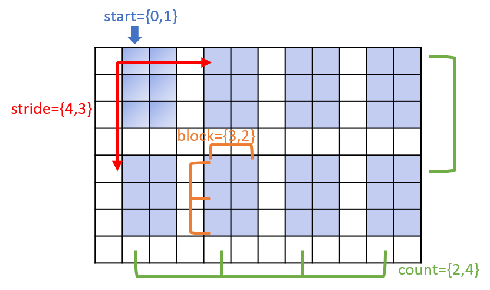

Working with Datasets
=========================

.. include:: /global.rst

.. namespace:: HIPP::IO::H5

HDF5 datasets are the objects that actually save user data in storage. The meta-info, 
the :class:`Datatype` and :class:`Dataspace` of a dataset, describe the element type 
and the layout of those elements. 

For both clarity and flexibility, HIPP defines two sets of API for dataset operations

- :class:`DatasetManager`: a manager for all datasets in a group. 
  The manager provides high-level API which are sufficient for most 
  commonly I/O patterns. Datatype and dataspace are not directly manipulated 
  by users but they are implicitly deduced by the data object.
- :class:`Group` and :class:`Dataset`: more detailed controls over datasets.
  Dataset creation, opening, writing/reading processes are separately handled with 
  detailed datatype and dataspace controls.

In the following sections, we begin with the high-level :class:`DatasetManager` API
and then move to the detailed API for datasets.

.. _tutor-io-h5-using-dataset-manager:

Using the Dataset Manager
--------------------------

The method :expr:`Group::datasets()` returns a dataset manage typed 
:class:`DatasetManager`
for the caller group. For example, we create a new file and get a group manager 
for it (i.e., its root group)::

    H5::File f1("f1.h5", "w");
    auto dsets = f1.datasets();

The dataset manager can tell whether or not a dataset of given name exists under 
the group. For example, because ``f1`` is empty now, the following assertion 
passes::

    assert( !dsets.exists("dataset_A") );

The following parts demonstrate how to use the manager to

- Writing/reading data of either numerical types or strings.
- Subsetting the data to write/read.

Put/Get Numerical Data
""""""""""""""""""""""""

Dataset managers support various types of data, including 

- single scalar value, such as ``int``, ``float``;
- :class:`GeneralArrayTraits` compliant container of scalar values, such as ``std::vector`` with scalar ``value_type``;
- :class:`RawArrayTraits` compliant object of scalar values, such as raw arrays (``int [3]``, ``float [2][3]``), or 
  ``std::array`` with arbitrary nesting depth (``std::array<int, 3>``, ``std::array<std::array<int, 3>, 2>``);
- :class:`GeneralArrayTraits` compliant container of :class:`RawArrayTraits`, ``such as std::vector< std::array<int, 3> >``.

For example, consider the following objects to be written into a file::

    short s;
    vector<double> d10(10);
    int i5[5];
    long l34[3][4];
    array<float, 3> f3;
    vector<array<int, 3> > i83(8);

    // We initialize them, for example, for i83
    for(size_t i=0; i<8; ++i)
        for(size_t j=0; j<3; ++j)
            i83[i][j] = i*3+j;

To write those objects into a file, simply call the method :expr:`DatasetManager::put(name, data)`
where ``name`` is the dataset name in the file and ``data`` is an object to be written::

    dsets.put("s",      s);                     // Create a new dataset and write to it
    dsets.put("d10",    d10);
    dsets.put("i5",     i5);
    dsets.put("l34",    l34);
    dsets.put("f3",     f3);
    dsets.put("i83",    i83);

The call automatically creates the dataset and write data into it. If it already exists, 
the call overwrite it. In the later case the data in memory must have consistent datatype 
and dataspace to the existing dataset.

To load data from the file, call :expr:`DatasetManager::get(name, data)` where the dataset content is 
written into ``data``. If the outer-most container is a ``std::vector`` , it is resized to exactly 
fit the dataset. If the resize is not feasible, an :class:`HIPP::ErrorLogic` exception is thrown::

    dsets.get("s",      s);                     // Read back the data.
    dsets.get("d10",    d10);
    dsets.get("i5",     i5);
    dsets.get("l34",    l34);
    dsets.get("f3",     f3);
    dsets.get("i83",    i83);

The ``get`` method has an additional single-argument version::

    s = dsets.get<short>("s");
    f3 = dsets.get<array<float, 3> >("f3");

In this version, an object whose type is given by the template argument is default-constructed, 
passed into the two-argument version to get its data, and returned.

The content of file shown by ``h5ls -r f1.h5`` is like:

.. code-block:: text

    /d10                     Dataset {10}
    /f3                      Dataset {3}
    /i5                      Dataset {5}
    /i83                     Dataset {8, 3}
    /l34                     Dataset {3, 4}
    /s                       Dataset {SCALAR}

Put/Get Strings 
""""""""""""""""""

Strins have very special types. C-style strings are usually stored in raw arrays of 
characters, if their lengths have a predefined upper bound, or otherwise they are stored
in heap memory segments and manipulated by pointers. In C++, strings are usually represented 
by ``std::string``. 

For the sake of simplicity, the dataset manager supports the following types of string data:

- Single string, such as ``std::string``,
  ``(const) char [N]``, ``(const) char *`` (null-terminated).
  The single string is represented by ATOMIC STRING datatype in the file.
- Strings: either a ``std::vector<std::string> >`` instance or ``(const) char[N_STR][STR_LEN]``.
  The strings are represented by an 1-D array of ATOMIC STRING datatype in the file.

For example, consider the following "string object"::

    string str = "foo";
    vector<string> str4 = {"top", "bottom", "left", "right"};
    char raw_str[16] = "foo";
    char raw_str4[4][16] = {"top", "bottom", "left", "right"};

To write them into the file, call :expr:`DatasetManager::put_str(name, data)`. 
The library will figure out the correct datatype and dataspace for each of them::
    
    dsets.put_str("str", str);
    dsets.put_str("str4", str4);
    dsets.put_str("raw_str", raw_str);
    dsets.put_str("raw_str4", raw_str4);

To load back the data, call :expr:`DatasetManager::get(name, data)` instead::

    dsets.get_str("str", str);
    dsets.get_str("str4", str4);
    dsets.get_str("raw_str", raw_str);
    dsets.get_str("raw_str4", raw_str4);

Only in the ``std::string`` and ``std::vector< std::string >`` cases, the objects 
are auto-resized to fit the dataset. In other cases, the object must be large enough 
to hold the dataset.

The ``std::string`` or ``std::vector< std::string >`` case also has single-argument version, where 
the loaded string or strings are returned::

    str = dsets.get_str<string>("str");
    str4 = dsets.get_str<vector<string> >("str4");

The content of the file shown by ``h5ls -r f1.h5`` is like:

.. code-block:: text

    /raw_str                 Dataset {SCALAR}
    /raw_str4                Dataset {4}
    /str                     Dataset {SCALAR}
    /str4                    Dataset {4}

Subsetting the Data
""""""""""""""""""""""

The dataset manager provides three methods for the case that only a subset of the 
whole dataset is the target of reading.

The call of :expr:`DatasetManager::at(name, data, coord)` loads a single element 
at given coordinate ``coord`` in the dataset named ``name`` into ``data``. 
For example, the following codes load an element at position ``(1,2)``::

    int i_value;
    dsets.at("i83", i_value, {1,2});

    pout << i_value, endl;            // => 5

The call :expr:`DatasetManager::ats(name, data, coords)` loads a set of points 
into a container object ``data``. The coordinates of the points is given by 
``coords``, which is typed :class:`Points` and can be initialized with the 
number of points and the starting address of the coordinate array::

    vector<int> i_values;
    vector<hsize_t> coords = {
        0,0, 
        1,1, 
        2,2};
    
    dsets.ats("i83", i_values, {3, coords.data()});
    
    pout << i_values, endl;           // => 0,4,8

The call of :expr:`DatasetManager::slab(name, data, slab)` loads a hyperslab.
The geometry of the hyperslab is specified by ``slab`` that is typed 
:class:`Hyperslab` and can be initialized by the starting coordinate and 
the number of elements at all dimensions.
For example, the following codes load a hyperslab ``[1:(1+2)][0:(0+3)]``::

    dsets.slab("i83", i_values, {{1, 0}, {2, 3}});
    
    pout << i_values, endl;           // => 3,4,5,6,7,8

For ``ats`` and ``slab``, the argument ``data`` must has consistent size to 
the selected part of data. If it is a ``std::vector`` of numerical or RawArrayTraits 
compliant type, it is auto-resized to fit the selection.

For writing, we have :expr:`DatasetManager::put_at`, :expr:`DatasetManager::put_ats`,
and :expr:`DatasetManager::put_slab`. The three calls require that 
the dataset is already existing in the file, and overwrite the selected part.

Datatype 
-----------

A :class:`Datatype` instance describes the detail 
(i.e., size, bit-level interpretation and conversion) of a data element in 
the storage.

.. _tutor-io-h5-datatype-predefined-native:

HIPP predefines a set of commonly used datatypes that corresponds to the native 
types in C++:

.. table::
    :class: tight-table

    ============================================== =======================================================================
    C++ Type                                       Corresponding :class:`Datatype` Instance
    ============================================== =======================================================================
    ``float``, ``double``, ``long double``         :var:`NATIVE_FLOAT_T`, :var:`NATIVE_DOUBLE_T`, :var:`NATIVE_LDOUBLE_T`
    ``char``, ``signed char``, ``unsigned char``   :var:`NATIVE_CHAR_T`, :var:`NATIVE_SCHAR_T`, :var:`NATIVE_UCHAR_T`             
    ``short``, ``unsigned short``                  :var:`NATIVE_SHORT_T`, :var:`NATIVE_USHORT_T`
    ``int``, ``unsigned int``                      :var:`NATIVE_INT_T`, :var:`NATIVE_UINT_T`
    ``long``, ``unsigned long``                    :var:`NATIVE_LONG_T`, :var:`NATIVE_ULONG_T`
    ``long long``, ``unsigned long long``          :var:`NATIVE_LLONG_T`, :var:`NATIVE_ULLONG_T`
    ============================================== =======================================================================

Standard datatypes are defined for platform-independent storage, with suffix

- ``F`` for floating-point number, ``I`` for signed integer and ``U`` for unsigned interger; 
- ``BE`` for big-endian byte order and ``LE`` for the little endian.

.. table::
    :class: tight-table

    ============================================== ===============================================
    Little-endian                                   Big-endian
    ============================================== ===============================================
    :var:`IEEE_F32LE_T`, :var:`IEEE_F64LE_T`       :var:`IEEE_F32BE_T`, :var:`IEEE_F64BE_T`    
    :var:`STD_I8LE_T`, :var:`STD_U8LE_T`           :var:`STD_I8BE_T`, :var:`STD_U8BE_T`
    :var:`STD_I16LE_T`, :var:`STD_U16LE_T`         :var:`STD_I16BE_T`, :var:`STD_U16BE_T`
    :var:`STD_I32LE_T`, :var:`STD_U32LE_T`         :var:`STD_I32BE_T`, :var:`STD_U32BE_T`
    :var:`STD_I64LE_T`, :var:`STD_U64LE_T`         :var:`STD_I64BE_T`, :var:`STD_U64BE_T`
    ============================================== ===============================================

The special datatype, :var:`C_S1_T`, is ATOMIC STRING datatype, which describe a C-style 
string with fixed length.

The native datatypes are sufficient for most applications. 
The standard datatypes are defined only for rare cases where the data element in the file 
has to be in specific format.

Users may define their own datatype based on existing ones to describe more complicated 
data element, such as array or structured record.

Using Predefined Datatypes 
""""""""""""""""""""""""""""""""

All the predefined datatypes are global static variables. For example, 
the datatypes that correspond to ``double`` and ``int`` can be referred to 
as::

    const H5::Datatype &dt_f = H5::NATIVE_DOUBLE_T, 
         &dt_i = H5::NATIVE_INT_T;

You cannot modify a predefined datatype, but you can retrieve its details, for example, 
its size and and datatype class::

    assert( dt_f.get_class() == dt_f.cFLOAT );
    assert( dt_i.get_class() == dt_i.cINTEGER );

    pout << "size of float type = ", dt_f.size(), 
            ", size of int type = ", dt_i.size(), endl;

The output is:

.. code-block:: text 

    size of float type = 8, size of int type = 4

The datatype class is copy-constructable and copy-assignable - but the copy is 
shallow, i.e., the resulting instance refers to the same underlying HDF5 resource 
(``operator==`` returns true).
To make a deep copy, use the :expr`Datatype::copy()` method - the resulting instance 
refers to another HDF5 resource but describes the same data layout 
(:expr:`Datatype::equal()` returns true)::

    auto dt_f2 = dt_f;              // Shallow copy, refer to the same datatype.
    auto dt_f3 = dt_f.copy();       // Deep copy, get a new datatype.
    
    assert( dt_f == dt_f2 && dt_f.equal(dt_f2) );
    assert( dt_f != dt_f3 && dt_f.equal(dt_f3) );

Atomic String Datatype
""""""""""""""""""""""""

To get a datatype that describes a fixed-length C-style string, 
call :expr:`Datatype::resized(n)` on the instance :var:`C_S1_T` with 
desired string length ``n``. For example, to contain the following string 
``"foo"``, which has 4 characters including the null-terminator, you 
may define a larger string datatype of length 10::
    
    const char s[] = "foo";
    auto dt_s = H5::C_S1_T.resized(10);

    assert( dt_s.get_class() == dt_s.cSTRING );
    pout << "size = ", dt_s.size(), endl;

The output is:

.. code-block:: text 

    size = 10

Array Datatype
""""""""""""""""""

To get a datatype that describes a C-style raw array, call
:expr:`Datatype::create_array(dims)` on an existing element datatype with 
desired dimensions ``dims``.
For example, the following codes create the datatype for ``int arr[3][4]``::

    int arr[3][4];
    auto dt_a1 = H5::NATIVE_INT_T.create_array({3,4});

The library also defines another method :expr:`Datatype::create_array_for<T>()`,
which takes a template argument and infers the element datatype and dimensions 
from it. Thus, the above call is equivalent to::

    auto dt_a2 = H5::NATIVE_INT_T.create_array_for< decltype(arr) >();

To retrieve the array rank and dimensions, call :expr:`Datatype::array_ndims()`
and :expr:`Datatype::array_dims()`, respectively::

    pout << "rank = ",   dt_a1.array_ndims(), 
            ", dims = ", dt_a1.array_dims(), endl;

The output is:

.. code-block:: text 

    rank = 2, dims = Dimensions{3,4}

Compound Datatype
""""""""""""""""""""

Structured types in C++ are usually defined to describe objects with multiple 
attribute. For example, the following type ``S`` has four fields ``a``, ``b``, 
``c``, and ``d``::
    
    struct S {
        int a;
        float b;
        double c[2][3];
        std::array<int, 2> d;
    } comp;

To define the HDF5 datatype for a structured type, first, 
call :expr:`Datatype::create_compound(size)`
with desired byte ``size`` to get an empty datatype, and then, call
:expr:`Datatype::insert(name, offset, dtype)` to insert a new
field whose name, byte offset and datatype are specified by the three arguments, 
respectively. If the type of the field has a predefined HDF5 native datatype 
counterpart (i.e., numerical scalar, see 
:ref:`Native Datatypes <tutor-io-h5-datatype-predefined-native>`), 
or the field is a raw array of such a numerical scalar, you may just 
pass a pointer to that class member, from which the offset and datatype are 
inferred automatically::

    auto dt_comp1 = H5::Datatype::create_compound(sizeof(S));
    dt_comp1.insert("a", dt_comp1.offset(&S::a), H5::NATIVE_INT_T)
        .insert("b", &S::b)
        .insert("c", &S::c)
        .insert("d", &S::d);

Note that ``insert`` returns a reference to the instance itself, so that multiple 
calls can be chained.

If all the fields are known when constructing the compound datatype, it is 
simpler to use another overload of ``create_compound``::

    auto dt_comp2 = H5::Datatype::create_compound(
        "a", &S::a,     "b", &S::b,
        "c", &S::c,     "d", &S::d);

Here, for each class field, we pass its name and pointer to the method. 
The library automatically identifies the datatype size, the offsets and 
datatypes of all fields.

Note that the order of the fields does not matter. It is not necessary to 
specify all fields, i.e., useless field may be ignored.

To retrieve the member information in a compound datatype, use 
:expr:`Datatype::nmembers()` for the total number of fields, 
:expr:`Datatype::member_index(name)` for the index of a field with given 
name, 
:expr:`Datatype::member_name(idx)`, 
:expr:`Datatype::member_class(idx)`
and :expr:`Datatype::member_offset()` for the name, class and offset, 
respectively, of a field with given index::

    pout << 
        "no. members = ",            dt_comp1.nmembers(), '\n',
        "index of a = ",             dt_comp1.member_index("a"), '\n',
        "name of the 2nd member = ", dt_comp1.member_name(1), '\n',
        "3nd member class,offset = ", dt_comp1.member_class(2), ',', 
            dt_comp1.member_offset(2), '\n';

The output is:

.. code-block:: text 

    no. members = 4
    index of a = 0
    name of the 2nd member = b
    3nd member class,offset = 10,8

Map C++ Types to HDF5 Datatypes
""""""""""""""""""""""""""""""""""""

To aid the meta-programming, HIPP defines mappings from C++ types to HDF5 Datatypes.

The method :expr:`Datatype::from_type<T>()` takes a template argument ``T`` and 
returns the corresponding HDF5 Datatype instance. This works for all C++ types 
with corresponding predefined HDF5 native datatypes 
(i.e., numerical scalar, see :ref:`Native Datatypes <tutor-io-h5-datatype-predefined-native>`), 
or :class:`~HIPP::RawArrayTraits` compliant type with any of such scalar as element.

For example, the following codes map ``int``, ``float`` and ``double [3][4]`` to 
the corresponding HDF5 datatype::
    
    auto dt_int =     H5::Datatype::from_type<int>(),
        dt_float =    H5::Datatype::from_type<float>(),
        dt_double34 = H5::Datatype::from_type<double[3][4]>();

For buffer-like objects such as :class:`~HIPP::GeneralArrayTraits` compliant ones,
the method :expr:`Datatype::from_buff(buff)` returns the datatype of its element.

For example, the following ``buff1``, ``buff2``and ``buff3`` all have element 
datatype ``dt_int = NATIVE_INT_T``::

    vector<int> buff1;
    std::array<int, 3> buff2;
    int buff3[3][4];
    dt_int = H5::Datatype::from_buff(buff1);
    dt_int = H5::Datatype::from_buff(buff2);
    dt_int = H5::Datatype::from_buff(buff3);

.. _tutor-io-h5-geometry-types:

The Geometry Types 
--------------------

To aid the description of dataspaces, HIPP defines the following **geometry types**:

- :class:`Dimensions`: describes the dimensions of a dataspace or the coordinates
  of a point in a dataspace.
- :class:`Points`: describes the coordinates of a set of points in a dataspace.
- :class:`Hyperslab`: describes a hyperslab.

Each of them is described by a single section in the following.

.. _tutor-io-h5-geometry-types-dimension:

Dimensions
""""""""""""""

A :class:`Dimensions` instance describes the dimensions of a dataspace or the 
coordinates of a point in a dataspace.

Several constructors are defined for the :class:`Dimensions` type::

    H5::Dimensions dims1,                   // rank = 0.
        dims2 {3,4},                        // rank = 2, dimensions = {3,4}.
        dims3(vector<size_t>{3,4}),         // rank = 2, dimensions = {3,4}.
        dims4(dims3.data(), dims3.ndims()), // copy from a buffer.
        dims5 = dims4;                      // copy from another Dimensions.

To reset the values of a :class:`Dimensions` instance, 
either call :expr:`Dimensions::set()` with argument(s) the same as the constructors,
or copy-assign from another :class:`Dimensions` instance::

    dims1.set({3,4});                       
    dims1.set(vector<size_t>{3,4});
    dims1.set(dims3.data(), dims3.ndims());
    dims1 = H5::Dimensions {3,4};           // copy assignment.

The :class:`Dimensions` type has methods that are similar to ``std::vector``. 
For example, you may 

- push-back an element with :expr:`Dimensions::push_back()` , causing the rank increased by 1.
- resize the object by :expr:`Dimensions::resize()`.
- visit its elements by ``[]``.

.. code-block::

    dims1.push_back(5);                     // {3,4,5}.
    dims1.resize(4); dims1[3] = 6;          // {3,4,5,6}.

To visit the object as a "range", you can 

- get the buffer address using :expr:`Dimensions::data()` and the rank using :expr:`Dimensions::ndims()`.
- Get the range iterators using :expr:`Dimensions::begin()` and :expr:`Dimensions::end()`.
- Retrieve the values as a ``std::vector`` using :expr:`Dimensions::as_vector()`.
- Print the object by streaming it into a ``std::ostream`` or other stream-like objects.

.. code-block::

    H5::Dimensions::value_t *data = dims1.data();   
    size_t ndims = dims1.ndims();
    vector<H5::Dimensions::value_t> &vec = dims1.as_vector();       // get a vector {3,4,5,6}.
    pout << "dims1 = {", pout(data, data+ndims), "}\n";             // print dims1 = {3,4,5,6}.
    pout << "dims1 = {", pout(dims1.begin(), dims1.end()),"}\n";    // the same.
    pout << dims1, endl;                                            // print the object.

The method :expr:`Dimensions::empty()` tests whether or not the dimensions is empty, i.e., rank = 0.
:expr:`operator ==` can be used to check the equality of two :class:`Dimensions` objects, 
i.e., whether or not they have the same rank and dimensions.
:expr:`Dimensions::n_elems()` get the total number of elements in the space, i.e., the 
products of all dimensions::

    assert( !dims2.empty() );           // empty check.
    assert( dims2 == dims3 );           // equality check.
    assert( dims2.n_elems() == 3*4 );   // total no. of elements.

.. _tutor-io-h5-geometry-types-points:

Points 
""""""""""""

A :class:`Points` instance describes the coordinates of a set of points in a dataspace.
You can construct a instance with different ways::

    H5::Points::value_t coords[] = { 0,1,  2,3, 4,4 };
    H5::Points pts1,            // 0 points.
        pts2(3, coords),        // 3 points whose coordinates are {0,1}, {2,3}, {4,4}, respectively.
        pts3(3, 2, coords);     // also specify the rank of the space.

Note that for ``pts2`` we ignore the rank of the space, which is to be determined 
by the context when you use the instance.

Note that the :class:`Points` instance does not hold the data - it only refers 
to buffer passed to the constructor. If the buffer is destroyed or changed, 
the :class:`Points` object may be invalid.

To retrieve the pointer to the coordinates buffer, the number of points and the rank of 
the space, call the corresponding methods::

    pts1.coords();              // => a pointer to the coords array.
    pts1.n_points();            // => no. of points.
    pts1.n_dims();              // => the rank of the space.

.. _tutor-io-h5-geometry-types-hyperslab:

Hyperslab
""""""""""""""

A :class:`Hyperslab` instance describes a hyperslab, i.e., equal-extent blocks 
with regular stride along each dimension.

To fully describe a hyperslab, four parameters are needed:

- ``start``: the starting coordinates of the first block.
- ``count``: the number of block along each dimension.
- ``stride``: the stride between blocks along each dimension.
- ``block``: the extent of a block.

The following figure demonstrates a typical hyperslab in a dataspace. The dataspace
is a simple array with extents ``{8,12}``. The hyperslab starts at coordinates ``{0,1}``.
Blocks in the hyperslab have stride ``{4,3}``. The whole hyperslab has ``{2,4}`` blocks
and each block has dimensions ``{3,2}``.

.. _fig-tutor-io-hyperslab-select.png:

    **A hyperslab (blue-shaded areas) in a SIMPLE dataspace.**

The four parameters are all handled by :class:`Dimensions` objects.  
``stride`` and ``block`` are optional - if not specified, it is 
assumed to be ``1`` along each dimension.

Several constructors are defined for :class:`Hyperslab`::

    H5::Hyperslab slab1,                        // rank = 0, empty hyperslab.
        slab2(dims2, {2,3}),                    // rank = 2, start = dims2, count = {2,3}.
        slab3(dims2, {2,3}, {5,10}, {2,2});     // also specify stride = {5,10}, block size = {2,2}.

To retrieve the parameters of a hyperslab, use the corresponding methods::

    H5::Dimensions &start = slab1.start(), 
        &count  = slab1.count(),
        &stride = slab1.stride(),
        &block  = slab1.block();

.. _tutor-io-h5-dataspace:

Dataspace 
---------------

A :class:`Dataspace` instance describes the layout of data elements in storage.
The current version of the HDF5 library supports only SIMPLE dataspace 
(i.e., regular array) and several special dataspaces 
(all-space, null-space, and scalar-space). 
More flexible types of dataspaces may be supported in the future.

.. _tutor-io-h5-dataspace-creation-and-access:

Dataspace Creation and Access
""""""""""""""""""""""""""""""

The HDF5 library predefines three dataspaces as static member of class :class:`Dataspace`:

- :var:`Dataspace::vALL` : all data elements in the dataset. The exact meaning 
  depends on the context.
- :var:`Dataspace::vNULL` : an empty space, i.e., without any data element.
- :var:`Dataspace::vSCALAR` : a scalar space, i.e., containing only a single data element.

For example, the following codes create references to these three predefined variables::

    auto & dsp_all = H5::Dataspace::vALL,
         & dsp_null = H5::Dataspace::vNULL,
         & dsp_scalar = H5::Dataspace::vSCALAR;

To create a new dataspace, define a :class:`Dataspace` instance by passing the 
shape (i.e., dimensions) of it::

    H5::Dataspace dsp1 = {2,3},                     // dims = {2,3}.
        dsp2 ( vector<hsize_t>{2,3} ),              // using vector.
        dsp3 ( H5::Dimensions{2,3} ),               // using Dimensions.
        dsp4 = dsp1.copy();                         // exact copy.

All the above four dataspaces have ``ndims = 2`` and ``dims = {2, 3}``. 

You may print a :class:`Dataspace` instance by streaming it into a stream-like 
object::

    pout << dsp1, '\n', 
            dsp2, '\n', 
            dsp3, '\n',
            dsp4, endl;

The output is:

.. code-block:: text

    Dataspace{type=SIMPLE, dims={2,3}, maxdims={2,3}}
    Dataspace{type=SIMPLE, dims={2,3}, maxdims={2,3}}
    Dataspace{type=SIMPLE, dims={2,3}, maxdims={2,3}}
    Dataspace{type=SIMPLE, dims={2,3}, maxdims={2,3}}
    
The method :expr:`Dataspace::get_type()` returns the class of the dataspace. It 
can be either :expr:`Dataspace::cNULL`, :expr:`Dataspace::cSCALAR`, 
or :expr:`Dataspace::cSIMPLE`::

    assert( dsp_null.get_type() == dsp_null.cNULL );
    assert( dsp_scalar.get_type() == dsp_scalar.cSCALAR );
    assert( dsp1.get_type() == dsp1.cSIMPLE );        

To retrieve the shape of a dataspace instance, call :expr:`Dataspace::ndims()`, 
:expr:`Dataspace::dims()` and :expr:`Dataspace::size()`. They return the rank,
the dimensions, and the total number of elements (i.e., product of dimensions),
respectively, of the dataspace::

    int ndims = dsp1.ndims();                       // => 2
    auto dims = dsp1.dims();                        // => {2,3}
    hsize_t size = dsp1.size();                     // => 6
    
.. _tutor-io-h5-subsetting:

Sub-setting a Dataspace
""""""""""""""""""""""""""

In special cases where only a subset of a dataset is the I/O target, using the 
"selection" mechanism on the dataspace is beneficial. By selecting/sub-setting 
a dataspace, the extents of the dataspace are not changed, 
but the library maintains extra information about which elements are selected in 
the dataspace. Then, in the I/O process, only the selected elements in the whole 
dataset are touched.

HDF5 provides four kinds of selection functions:

- **All**: select all elements in a dataspace. The is the default when a new 
  dataspace is created. (:expr:`type = Dataspace::selALL_T`)
- **None**: none of the elements is selected. (:expr:`type = Dataspace::selNONE_T`)
- **Hyperslab**: select a hyperslab by specifying its start, count, and optionally,
  stride and block size, at each dimension. (:expr:`type = Dataspace::selHYPERSLABS_T`)
- **Elements**: select a set of elements with given coordinates. (:expr:`type = Dataspace::selPOINTS_T`)
    
For example, we create a new dataspace shaped ``{10, 10}``::

    H5::Dataspace dsp5 {10, 10};

By applying :expr:`Dataspace::select_none()` on it, all elements become un-selected.
The method :expr:`Dataspace::get_select_npoints()` allows examination of how 
many elements/points are selected::
    
    dsp5.select_none();
    pout << "no. selected points = \n";
    pout << "  none -> ", dsp5.get_select_npoints(), '\n';
    
The opposite extreme - :expr:`Dataspace::select_all()`, select all elements 
of a dataspace::

    dsp5.select_all();
    pout << "  all -> ", dsp5.get_select_npoints(), '\n';
    
The method :expr:`Dataspace::select_hyperslab()` accepts a :class:`Hyperslab` 
instance, and selects the elements described by that hyperslab. For example, 
we select :math:`3\times 4 = 12` elements starting at coordinate ``{2,2}``::

    dsp5.select_hyperslab({ {2,2}, {3,4} });
    pout << "  hyperslab -> ", dsp5.get_select_npoints(), '\n';

The method :expr:`Dataspace::select_elements()` accepts a :class:`Points`
instance, and selects elements whose coordinates are given the the points.
For example, we select three elements whose coordinates are 
``{1,1}, {2,3}, {3,5}``, respectively::

    hsize_t coords[] = {1,1,  2,3,  3,5};
    dsp5.select_elements({3, coords});
    pout << "  elements -> ", dsp5.get_select_npoints(), '\n';

To retrieve which kind of selection is used, call :expr:`Dataspace::get_select_type`.
For example, the "elements" selection is typed :expr:`Dataspace::selPOINTS_T`.
The method :expr:`Dataspace::select_valid()` checks whether or not the selection
is valid, i.e., all the coordinates are within the extents of the dataspace::

    assert( dsp5.get_select_type() == dsp5.selPOINTS_T );
    assert( dsp5.select_valid() );

The output is:

.. code-block:: text

    no. selected points = 
      none -> 0
      all -> 100
      hyperslab -> 12
      elements -> 3

Note that setting a new selection clears the old selection, and then applies
the new selection, i.e., the old and new selections are not combined.
The tutorial section :ref:`tutor-io-h5-geometry-types` describes how to create 
geometry types such as the :class:`Hyperslab` and :class:`Points`. 

.. _tutor-io-h5-dataset:

Dataset Operations 
-------------------

.. _tutor-io-h5-dataset-creation-and-opening:

Dataset Creation and Opening
""""""""""""""""""""""""""""""""
Whatever API to use for dataset creation, required information are: 
dataset name, datatype and dataspace. 
HIPP provides three levels of methods for dataset creation, from simple-but-constrained
to complex-but-general:

- Datatype and dataspace are auto-deduced from the data object. The methods 
  :expr:`Group::create_dataset_for(name, object)` and :expr:`Group::create_dataset_for_str(name, str_object)`
  are used for this purpose.
- Datatype is auto-deduced from the C++ type, dataspace is explicitly specified. 
  The methods :expr:`Group::create_dataset<T>(name, dataspace)` and 
  :expr:`Group::create_dataset_str(name, shape...)` are used in this cases.
- Datatype and dataspace are both explicitly specified. This is the most general case - call 
  :expr:`Group::create_dataset(name, datatype, dataspace)` with all the details passed.

The level-1 calls are the most convenient. 
For example, assume the following data objects are the targets to dump into a file ``f1``::

    short s;
    vector<double> d10(10);
    int i5[5];
    long l34[3][4];
    array<float, 3> f3;
    vector<array<int, 3> > i83(8);

The allowed types of data objects are the same as those in :ref:`tutor-io-h5-using-dataset-manager`.

To create a dataset for any of them, call :expr:`Group::create_dataset_for()` by passing the dataset 
name and the data object. The library auto-deduces all required information to create 
that dataset, but no data is actually written. On success, the newly created dataset is returned.
If the dataset of that name already exists, it is opened and returned::

    f1.create_dataset_for("s",   s);
    f1.create_dataset_for("d10", d10);
    f1.create_dataset_for("i5",  i5);
    f1.create_dataset_for("l34", l34);
    f1.create_dataset_for("f3",  f3);
    f1.create_dataset_for("i83", i83);

For string-like objects (see :ref:`tutor-io-h5-using-dataset-manager` for available types), such as::

    string str = "foo";
    vector<string> str4 = {"top", "bottom", "left", "right"};
    char raw_str[16] = "foo";
    char raw_str4[4][16] = {"top", "bottom", "left", "right"};

Call :expr:`Group::create_dataset_for_str()` to create datasets for them::

    f1.create_dataset_for_str("str",      str);
    f1.create_dataset_for_str("str4",     str4);
    f1.create_dataset_for_str("raw_str",  raw_str);
    f1.create_dataset_for_str("raw_str4", raw_str4);

The file contents shown by ``h5ls -r`` is:

.. code-block:: text

    /                        Group
    /d10                     Dataset {10}
    /f3                      Dataset {3}
    /i5                      Dataset {5}
    /i83                     Dataset {8, 3}
    /l34                     Dataset {3, 4}
    /raw_str                 Dataset {SCALAR}
    /raw_str4                Dataset {4}
    /s                       Dataset {SCALAR}
    /str                     Dataset {SCALAR}
    /str4                    Dataset {4}

The level-2 calls auto-deduce the datatype from C++ type, but the dataspace is 
manually passed. For example, for the above data object ``s``, ``i83``, and 
string-like objects, the equivalent level-2 calls are::

    f1.create_dataset<short>("s", H5::Dataspace::vSCALAR);
    f1.create_dataset<int>("i83", {8,3});

    f1.create_dataset_str("str", str.size()+1);
    f1.create_dataset_str("raw_str4", 4, 16);

The level-3 call allows user to pass both datatype and dataspace. The level-3 
equivalents to the above dataset creation procedures are::

    f1.create_dataset("s",   H5::NATIVE_SHORT_T, H5::Dataspace::vSCALAR);
    f1.create_dataset("i83", H5::NATIVE_INT_T,  {8,3});

    f1.create_dataset("str",      H5::C_S1_T.resized(str.size()+1), H5::Dataspace::vSCALAR);
    f1.create_dataset("raw_str4", H5::C_S1_T.resized(16),           {4});

To open an existing dataset, use :expr:`Group::open_dataset(name)` with given 
dataset ``name``. For example, to open the dataset "s" created above, write::

    auto s_dset = f1.open_dataset("s");

.. _tutor-io-h5-dataset-read-write:

Read/Write Data 
""""""""""""""""

Once a dataset is created or opened, read/write operations can be performed on 
the :class:`Dataset` instance.

For example, the following codes write a raw array and a ``std::vector`` object 
into two newly created datasets, respectively::

    long l34[3][4];
    vector<double> d10(10);

    auto dset_l34 = f1.create_dataset_for("l34", l34),
         dset_d10 = f1.create_dataset_for("d10", d10);

    dset_l34.write(l34);
    dset_d10.write(d10);

The acceptable data object argument to :expr:`Dataset::write()` are the same as 
that to :expr:`Group::create_dataset_for()`.

The memory data elements to be read/written may have different datatype from the 
file data elements, but the implicit conversion must be available. 
The memory dataspace may also be different, but the total 
number of elements must match that in file. For example, write 10 single-precision 
floating-point values to the above dataset, ``d10``, is valid::
    
    float f10[10];
    dset_d10.write(f10);

Data elements in raw memory buffer cannot have auto-deduced datatype. User must 
specify its datatype::

    void *ptr_f10 = new float[10];
    dset_d10.write(ptr_f10, H5::NATIVE_FLOAT_T);

String-like objects are written by :expr:`Dataset::write_str()` method. Allowed 
string-like types are the same as those for :expr:`Group::create_dataset_for_str()`.
For example, the following codes write a single string and a `std::vector` of 
strings into two newly-created datasets, respectively::

    string str = "foo";
    vector<string> str4 = {"top", "bottom", "left", "right"};

    auto dset_str = f1.create_dataset_for_str("str", str),
         dset_str4 = f1.create_dataset_for_str("str4", str4);
    
    dset_str.write_str(str);
    dset_str4.write_str(str);

The method :expr:`Dataset::read()` reads the data elements from a dataset to 
a data object. The object must have consistent (i.e., convertible) datatype 
and the same number of elements. For example, the above dataset ``dset_l43`` is 
read by::

    dset_l34.read(l34);

Or::

    long l12[12];               // Readable if the size matches.
    dset_l34.read(l12);

If the argument is a ``std::vector``, it is auto-resized to match the file 
dataspace::

    vector<long> v1;            // vector is auto-resized.
    dset_l34.read(v1);
    assert(v1.size() == 12);

The ``value_type`` of the ``std::vector`` may be a :class:`~HIPP::RawArrayTraits` compliant 
type, as long as its size is a divisor of the size of the file dataspace::

    vector<array<long, 4> > v2;
    dset_l34.read(v2);
    assert(v2.size() == 3);

If the resize is not feasible, a :class:``~HIPP::ErrorLogic`` exception is thrown::

    vector<array<long, 5> > v3;
    dset_l34.read(v3);          // Fail and throw an ErrLogic.

String-like data object is similar but read through :expr:`Dataset::read_str()`
If the argument is a ``std::string`` or ``std::vector<std::string>``, it is auto-adjusted
to fit the file contents::

    string s1;
    vector<string> v4;
    dset_str.read_str(s1);
    dset_str4.read_str(v4);

.. _tutor-io-h5-dataset-subsetting:

Sub-setting the Data 
""""""""""""""""""""""

The **sub-setting** I/O operations are designed for the cases where only a subset 
of the whole dataset is the target. We have three sub-setting
operations for both reading and writting:

- :expr:`Dataset::read_element()` and :expr:`Dataset::write_element()`: read/write a single 
  scalar element at a given coordinate in the dataspace.
- :expr:`Dataset::read_elements()` and :expr:`Dataset::write_elements`: read/write elements
  at a set of given coordinates.
- :expr:`Dataset::read_hyperslab()` and :expr:`Dataset::write_hyperslab()`: read/write elements 
  at a hyperslab in the dataset.

As an example, we create a new dataset shaped :math:`{3,4}` with integer elements::

    H5::File f1("f1.h5", "w");

    int i34[3][4] {};

    auto dset = f1.create_dataset_for("i34", i34);
    dset.write(i34);

We write a single element ``i`` at the coordinate ``{0, 1}`` by :expr:`Dataset::write_element()`::

    int i = 100;
    dset.write_element(i, {0,1});
    /*
    The dataset becomes
    0   100 0   0
    0   0   0   0
    0   0   0   0
    */

We write two elements of ``i2`` at the coordinates ``{0,2}`` and ``{0,3}``, respectively, 
by one call of :expr:`Dataset::write_elements()`::
    
    int i2[2] = {8, 16};
    hsize_t coords[] = {
        0,2,  
        0,3};
    dset.write_elements(i2, {2, coords});
    /*
    The dataset becomes
    0   100 8   16
    0   0   0   0
    0   0   0   0
    */

We write 6 elements of ``i23`` into a hyperslab starting at the coordinate ``{1,1}`` 
and extending ``{2,3}`` in the two axes, by :expr:`Dataset::write_hyperslab()`::

    int i23[2][3] = {0,1,2,3,4,5};
    dset.write_hyperslab(i23, {{1,1},{2,3}});
    /*
    The dataset becomes
    0   100 8   16
    0   0   1   2
    0   3   4   5
    */

The read calls are similar::

    int i;
    vector<int> v;
    
    dset.read_element(i, {0,1});
    dset.read_elements(v, {2, coords});
    dset.read_hyperslab(v, {{1,1},{2,3}});

:expr:`Dataset::read_element()` accepts a reference to a scalar as its first 
argument, while :expr:`Dataset::read_elements()` and :expr:`Dataset::read_hyperslab`
accepts a ``std::vector``. The vector is auto-resized to fit the number of loaded 
elements.