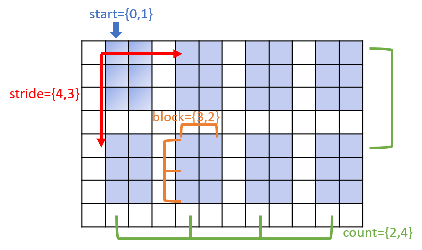
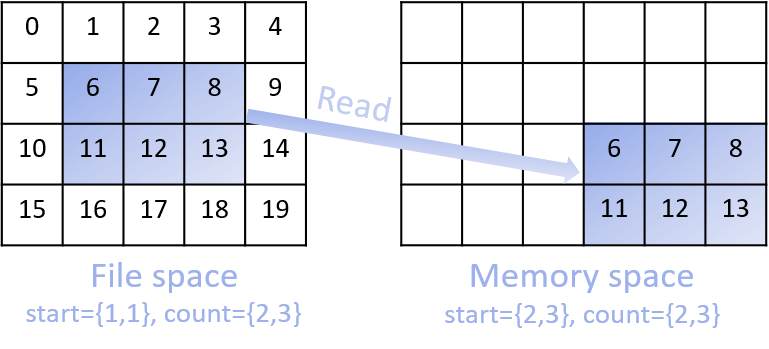

I/O Arrays of Numeric Types
===============================================================

All of the HIPP IO APIs can be accessed by including the header ``<hippio.h>``. The detailed conventions
and compiling options are described in the :ref:`API Reference <api-io-usage>`.

Write/Read Arrays
--------------------------------------------------------------

In C++ programming, an array of a numeric type (e.g., double, int, ...) is usually stored 
in the STL vector. Or it can be manualy stored in raw memory buffer such as those allocated by ``new``
operator or ``std::malloc()``. Examples of such arrays are::

    const size_t N = 5;
    vector<double> arr1 = {0.,1.,2.,3.,4.};                     // a vector of 5 elements 
    
    double *arr2 = new double [N];                              // raw buffer with 5 doubles

To write them into a file of HDF5 format, you simply create a file by defining a 
:class:`HIPP::IO::H5File` instance with desired filename and a "w" mode flag 
("w" means create and truncate the file). Then, a call of 
``create_dataset<T>(dataset_name, dims)`` creates a dataset in the root group of the 
file, with ``T`` specifying its element data type, ``dataset_name`` specifying its 
name and ``dims`` specifying its length in every dimension. 
Finally, a call of ``write(arr1)`` writes the vector ``arr1`` into the dataset::

    HIPP::IO::H5File file("arrays.h5", "w");                    // create a file           
    auto dset1 = file.create_dataset<double>("arr1", {N} );     // create a dataset 
    dset1.write(arr1);                                          // write out an array

The ``write()`` method also accepts a pointer to raw array. So, a call of 
``write(arr2)`` writes the data in ``arr2`` into the dataset. 
It is also allowed to chain the ``create_dataset()`` and ``write()`` operations
in one line of code::

    file.create_dataset<double>("arr2", {N}).write(arr2);       // write out from raw buffer

Note that the size of the dataset (specified in ``create_dataset()``) must be 
compatible with the argument passed in ``write()``, or otherwise the result is 
undefined.

To read the the dataset back into the memory, just open the dataset by ``open_dataset(dataset_name)``,
and load the data into a vector by ``read(vector_name)``. The library automatically resizes 
the vector according to the dataspace in the file::

    vector<double> arr1_in;
    file.open_dataset("arr1").read(arr1_in);                    // read into the vector

If you want to load the data into a raw buffer, you open the dataset, manually 
get its dataspace with ``dataspace()``, and find the size of the dataspace 
(total number of scalar elements) by ``size()``. Then you use the size to properly
allocate the memory buffer, and again use ``read()`` to load data::

    auto dset2 = file.open_dataset("arr2");
    size_t n_elems = dset2.dataspace().size();
    double *arr2_in = new double [n_elems];
    file.open_dataset("arr2").read(arr2_in);

For multi-dimensional array (stored in row-major order in contiguous memory), 
the only difference is that when ``create_dataset()``, you specify each of the dimensions
of that array. Then the write/read operations are the same as those of one-dimensional array

.. code-block:: cpp
    :emphasize-lines: 3

    const size_t n0=2, n1=3, n2=4;
    vector<int> arr3(n0*n1*n2);
    file.create_dataset<int>("arr3", {n0, n1, n2}).write(arr3);
    file.open_dataset("arr3").read(arr3);

    /**
     * Again, for a reading into raw buffer, use dataspace() to retrive the 
     * dataspace, and use size() to get the total number of elements.
     */
    auto dset3 = file.open_dataset("arr3");
    int *arr3_in_buff = new int[ dset3.dataspace().size() ];
    dset3.read(arr3_in_buff);

After the output operations, a file named "arrays.h5" is created in the OS's file system.
Using ``h5dump arrays.h5`` in the command line prompt, you can view and verify the content of 
each dataset

.. code-block:: text 

    HDF5 "arrays.h5" {
    GROUP "/" {
        DATASET "arr1" {
            DATATYPE  H5T_IEEE_F64LE
            DATASPACE  SIMPLE { ( 5 ) / ( 5 ) }
            DATA {
            (0): 0, 1, 2, 3, 4
            }
        }
        DATASET "arr2" ...
        DATASET "arr3" ...

.. warning::

    For both one-dimensional and multi-dimensional cases, the library only accepts 
    arrays with contiguous memory layout. That means the following cases cannot 
    be manipulated by HIPP::

        vector<vector<int> > vector_of_vectors;

        vector<double *> vector_of_pointers_to_buffers;

    The followings are allowed::

        vector<array<double, 3>> vector_of_arrays;

        struct ArrayType {
            float values[3];
        };
        vector<ArrayType> vector_of_structs;

        int raw_array[2][3];

    However, in such cases you need to take the pointer to the underlying data and 
    cast it into a proper numeric type::

        dset.write((double *)&vector_of_arrays[0]);
        dset.write((float *)&vector_of_structs[0]);
        dset.write(&raw_array[0][0]);

Select a Subset of a Dataset
-------------------------------

With very large dataset in a file, sometimes we just want to take a part of
the whole dataset. HDF5 "hyperslab" selection allows reading/writing a part 
of the dataset in file to/from a part of the data array in memory. 

For example, The :func:`read <HIPP::IO::H5Dataset::read>` member function of a :class:`H5Dataset <HIPP::IO::H5Dataset>` 
instance has two extra arguments, the ``memspace`` and
the ``filespace``, both typed :class:`H5Dataspace <HIPP::IO::H5Dataspace>`. 
They describe the data layout in the source dataset of the file and 
the data layout in the target memory array. 
By properly setting these two arguments, 
user informs the HDF5 library which part of data are going to be touched.
The member function :func:`write <HIPP::IO::H5Dataset::write>` has similar 
arguments for dataspaces. 

To describe a subset of the whole array (in either file or memory), you 
first create a :class:`H5Dataspace <HIPP::IO::H5Dataspace>` instance which 
gives the dimensions of the whole dataset. Then you call the 
method :func:`select_hyperslab <HIPP::IO::H5Dataspace::select_hyperslab>` on 
the dataspace instance to select a subset of the whole array.
In the reading/writing process, only the selected portion is touched.

A "hyperslab" of an array is a series of chunks of data elements. Each chunk 
has logically contiguous elements in all dimensions. Chunks may have regular gaps 
between them. The following :numref:`fig-tutor-io-hyperslab-select.png` show a typically hyperslab:

.. _fig-tutor-io-hyperslab-select.png:

    **A hyperslab (blue-shaded areas) of the whole array.**

A "hyperslab" is decribed by four parameters (all in the unit of array element, 
and in row-major order):

- ``start``: starting location of the "hyperslab", i.e., location of the first  
  element of the "hyperslab" in the whole array. 
- ``stride``: offset from each chunk to the next.
- ``count``: number of chunks in each dimension.
- ``block``: size of each chunk. 

In the above example in the figure, the whole array has dimensions ``{8, 12}``, and 
the "hyperslab" have ``start={0, 1}``, ``stride={4, 3}``, 
``count={2, 4}`` and ``block={3, 2}``
 
In the following example, we show how to use the "hyperslab" feature to select
a part of the dataset of a file and how to put it into a part of a memory buffer.
Here we want to select a single rectangular region, so the ``stride`` and ``block``
are ``1`` in all dimensions. ``count`` is the size of the region. Since this 
selection is frequently used, HIPP provides a "hyperslab" selection function
which defaults ``stride`` and ``block`` to ``1``.

The subsets of arrays in the file and in the memory are decribed in the following 
:numref:`fig-tutor-io-hyperslab-select.png`:

.. _fig-tutor-read-subset.png:

    **Read a subset of a 2D dataset in file to a subset of 2D array in memory.** 
    The subsets in file and in memory both have ``count={2, 3}``, but their 
    starting locations are different.

Where we want to move a ``count={2, 3}`` subset from a ``file_dims={4, 5}`` 
dataset to a ``mem_dims={4, 6}`` memory buffer 
(i.e., only ``{6,7,8,9,10,11,12,13}`` are moved).

First, we create the whole dataset, writing it to a file::

    using HIPP::IO::hsize_t;

    /* Write a 2D array into a HDF5 file. */
    vector<hsize_t> file_dims = {4, 5}; 
    vector<int> file_data = HIPP::ALGORITHM::LinSpaced(0, 4*5).get();
    HIPP::pout << "2Darray (file)=\n", 
        HIPP::PrtArray(file_data).ncol(5).width(3), endl;
    HIPP::IO::H5File("data.h5", "w").create_dataset<int>("2Darray", file_dims)
        .write(file_data);

Where we use :class:`HIPP::ALGORITHM::LinSpaced` to generate a linearly-spaced 
sequence.

Then, we properly select the "hyperslabs" of the filespace and memspace and pass 
them to :func:`read <HIPP::IO::H5Dataset::read>` method which transfers the 
data from file to memory::

    /* Specify the dataspace for file and memory arrays. */
    vector<hsize_t> mem_dims = {4, 6}, 
        file_start = {1, 1}, mem_start = {2, 3},
        count = {2, 3};
    HIPP::IO::H5Dataspace file_space(file_dims), mem_space(mem_dims);
    file_space.select_hyperslab(file_start, count);
    mem_space.select_hyperslab(mem_start, count);

    /* Read a subset from the HDF5 file into a subset of mem_data. */
    vector<int> mem_data(4*6);
    HIPP::IO::H5File("data.h5", "r").open_dataset("2Darray")
        .read(mem_data, mem_space, file_space);
    HIPP::pout << "2Darray (memory)=\n", 
        HIPP::PrtArray(mem_data).ncol(6).width(3), endl;

The output of the example is

.. code-block:: text 

    2Darray (file)=
      0,  1,  2,  3,  4,
      5,  6,  7,  8,  9,
      10, 11, 12, 13, 14,
      15, 16, 17, 18, 19
    2Darray (memory)=
      0,  0,  0,  0,  0,  0,
      0,  0,  0,  0,  0,  0,
      0,  0,  0,  6,  7,  8,
      0,  0,  0, 11, 12, 13
