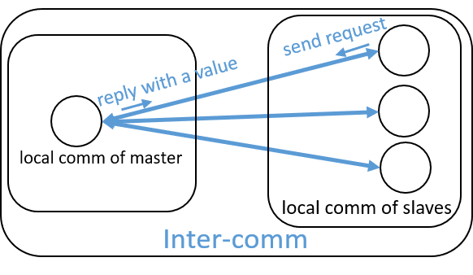

Inter-Communications
=======================

We demonstrate the creation and usage of inter-communicator
with an example - a Counter class. This example 
is taken from Ch-7.3 of [GroppW-UMPIv3]_. 
The full implementation can be 
downloaded at :download:`mpi/intercomm-counter.cpp </../example/tutorial/mpi/intercomm-counter.cpp>`.

Every parallel program needs work decomposition. Even for the data-parallel task, you have to assign 
chunks of data to different processes. A very useful model for task decomposition is the **master-slave**
model, where a master is responsible for the work assignment and all other processes are working to 
finish their assignment. If the work can be described by a single identifier, e.g., an integer value, 
then the master-slave model is quite easy - the master just waits for the work request from any slave and 
then reply to it with the work indentifier. 

Such a model is quite useful in many situations. It is self-scheduled, i.e., 
once a slave finishes its work, it request another. It scales well, as long as the 
number of processes is not so large that a single master can handle all requests.
We design a class interface for this model, encapsulating all the communication details.
The work identifier is an integer value in the range ``[0, max_count)`` where ``max_count``
is the total number of works defined by the class-user. We name the class to ``Counter``.
The communicators and 
communication modes are illustrated by the following :numref:`fig-tutor-mpi-advanced-intercomm-counter`.
The implementation is described in the remaining of this section.

.. _fig-tutor-mpi-advanced-intercomm-counter:

    **The inter-communicator of the master and slaves.** Two local communicators, one has only the master 
    process and the other has all slave processes, have been joined to an inter-communicator.

We define the ``Counter`` interface as following::

    using HIPP::MPI::Comm;

    class Counter {
    public:
        Counter(Comm &comm, int max_count, int comm_tag);
        bool get_next(int &count);
    private:
        Comm _inter_comm;
        int _count, _max_count;
    };

To use the ``Counter``, pass a communicator ``comm`` to specify all the processes 
involved in the communication, including the master and slaves. Because we have 
to perform some point-to-point communications in the construction of the ``Counter``,
a communication ``tag`` is necessary. The master 
waits for requests and sends replies in the constructor, until all work assigments 
are made. The slaves directly return from the constructor and use ``get_next()`` 
to get the next value of the counter. Once all values are assigned, ``get_next()``
returns ``false`` so that the slave knows that. 

The communication mode is best described by an inter-communicator. The master 
has its own local communicator and, separately, the slaves also have their
local communicator. The two local communicators are joined to form an 
inter-communicator. Within this new inter-communicator, any point-to-point 
communication targets at the remote group of processes. Hence, the ``rank``
argument in a communication call is the rank of process in the remote group.
Such a design obviously simplifies the logic of the parallel application. 
We use the member ``_inter_comm`` to represent the inter-communicator. The member 
``_count`` records the current value of the counter and ``_max_count`` records 
the maximal value.

The constructor of ``Counter`` is implemented in the following::

    Counter::Counter(Comm &comm, int max_count, int comm_tag) 
    : _inter_comm(nullptr), _count(0), _max_count(max_count)
    {
        int rank = comm.rank(), n_procs = comm.size(),
            is_master = (rank == 0),
            remote_leader = is_master, local_leader = 0;

        /* Split the global comm into two, and create an inter-comm of them. */
        auto local_comm = comm.split(is_master);
        _inter_comm = local_comm.create_inter(
            local_leader, comm, remote_leader, comm_tag);
        
        /* The master waits for request and replies. */
        if( !is_master ) return;
        int n_stop = 0;
        while( n_stop < n_procs-1 ){
            auto status = 
                _inter_comm.recv(HIPP::MPI::ANY_SOURCE, 0, NULL, 0, "int");
            _inter_comm.send(status.source(), 0, &_count, 1, "int");
            if( _count < _max_count ) 
                ++ _count;
            else 
                ++ n_stop;
        }
    }

Each process gets its local communicator by calling :func:`split <HIPP::MPI::Comm::split>`
on the global communicator. One local communicator has only the master process 
(rank 0 in the global communicator), 
while the other one has all the slaves. Then, the two local communicators 
are joined to create a new inter-communicator by calling :func:`create_inter <HIPP::MPI::Comm::create_inter>`.
Each process needs to pass the rank of leader process in the local group. 
The leader of each local gorup also needs to pass 
the rank of the leader process in the remote group, and the global communicator. 
A comunication ``tag`` is 
necessary because the creation of the inter-communicator involves several point-to-point 
communication in the global communicator.

Once we have the inter-communicator, the slaves just return from the constructor. The master, 
on the other hand, waits for the request from slaves and sends back replies with the values
of the counter. Once the maximal value is achieved, it sends the maximal value as the 
stop signal, and once the stop signal is sent to all slaves, the master returns.

The method ``get_next()`` is implemented in the following::

    bool Counter::get_next(int &count) {
        _inter_comm.send(0, 0, NULL, 0, "int");
        _inter_comm.recv(0, 0, &_count, 1, "int");
        if( _count < _max_count ){
            count = _count;
            return true;
        }else{
            return false;
        }
    }

where a slave simply sends a request (consisting of an empty message) and waits for 
the reply. If the stop signal is received, it returns ``false``.

As an example of using the ``Counter`` class, in the following, 
we declare a ``Counter`` instance by passing the 
global communicator, the maximal value, and the tag for creation of the inter-communicator.
The master process just waits in the constructor. The slaves all use ``get_next()``
to get the counter value. If it is a valid value (not a stop signal), the slave just prints it::

    HIPP::MPI::Env env;
    auto comm = env.world();
    int rank = comm.rank();
    
    int max_counts = 16, comm_tag = 0;
    Counter counter(comm, max_counts, comm_tag);
    if( rank != 0 ){
        int count;
        while(counter.get_next(count))
            printf("Process %d gets %d.\n", rank, count);
    }

The output is (run with 6 processes; may be different on different runs; output may interleave):

.. code-block:: text 

    Process 1 gets 1.
    Process 1 gets 8.
    Process 1 gets 13.
    Process 2 gets 2.
    Process 2 gets 9.
    Process 2 gets 14.
    Process 3 gets 3.
    Process 3 gets 5.
    Process 3 gets 10.
    Process 3 gets 15.
    Process 4 gets 4.
    Process 4 gets 6.
    Process 4 gets 11.
    Process 5 gets 0.
    Process 5 gets 7.
    Process 5 gets 12.

Because the counter is frequently used, HIPP provides a class :class:`HIPP::MPI::Counter`
for it. Is is more general in that 

-  the counting can restart repeatedly on one counter instance, with ``max_count`` 
   changed in different runs.
-  the datatype for the value can be arbitraty integer type.
-  the performance is better than the simple example here.

HIPP also provides a "symmetric" counter class :class:`HIPP::MPI::CounterS`. It has more 
advantages

- it is symmetric, i.e., no master process.
- multiple counters can be hosted by one counter instance. 