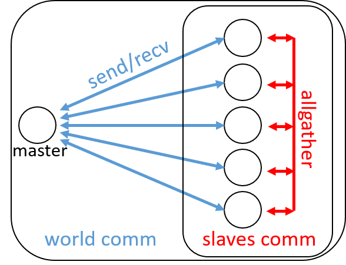
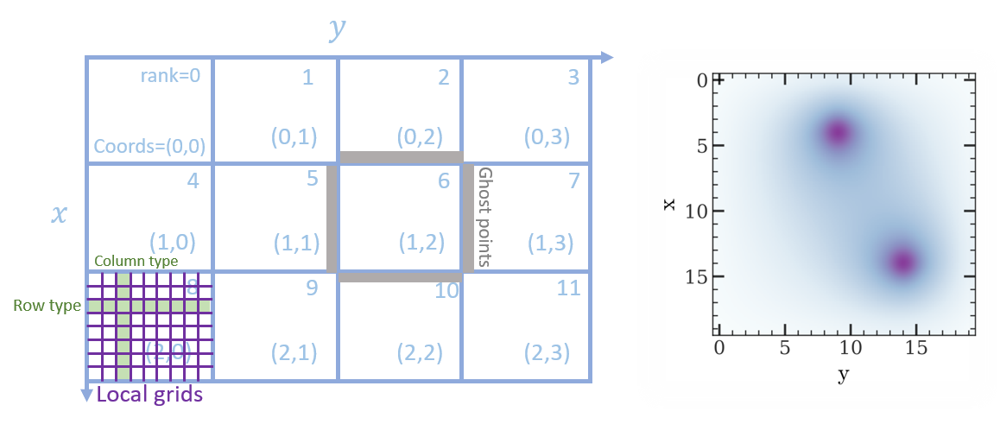
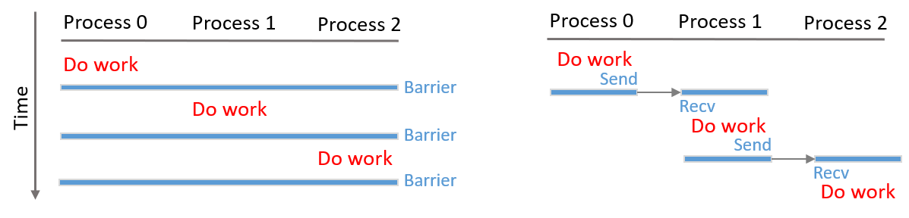

Communicators and Parallel Libraries
=======================================

.. include:: /global.rst

.. namespace:: HIPP::MPI

MPI provides an unusual feature - communicator, which is missing in many other 
parallel libraries. In many parallel libraries and applications, using the 
global "world" communicator (``MPI_COMM_WORLD`` in **Standard** MPI, or :func:`HIPP::MPI::Env::world` in HIPP)
is sufficient. However, it is always recomended not to use the global communicator
in any library development, just like that, in any programming, we should avoid using 
global varibles unless really necessary.

MPI's communicator is an encapsulation of 

- the **context** of point-to-point and collective communication, 
- the **process group** which participates the communication and the naming of them,
- the **logic topology** of processes, 
- and the caching of context-specific **attributes**. 

We will explore all these features by examples.

Creating and Using Communicators
----------------------------------

New communicators can be created from any existing, old communicator. 
In the following, we demonstrate the creation and usage of user-defined communicator
with an example - computing :math:`\pi` by a Monte-Carlo algorithm. This example 
is taken from Ch-3.8 of [GroppW-UMPIv3]_. The full implementation can be 
downloaded at :download:`mpi/pi-monte-carlo-computation.cpp </../example/tutorial/mpi/pi-monte-carlo-computation.cpp>`.

The algorithm is very famous, usually used as the first example of Monte-Carlo 
algorithm in many textbooks. It includes the following steps:

- Generate a set of :math:`N` random points. Each point :math:`(x,\,y)` is in the 2-dimensional square :math:`[-1,\,1]\times[-1,\,1]`.
- Count the number, :math:`N_{\rm in}`, of points in the unit circle :math:`\{(x,\,y)|x^2+y^2<1\}`. 
- Approximate :math:`\pi` by :math:`\pi = 4 N_{\rm in}/N`. 

The key step is to generate the random points. However, in a parallel implementation, the 
random number generation is a non-trival task. Here, just to demonstrate the 
communicators, we use a brute-force method - generate all the random numbers in 
a single process (referred as the master process thereafter), and spread them into other processes 
(referred as the slave processes). 
Note that this requires communication between the master and each slave.

For the slaves, once they determine their local :math:`N_{\rm in}`, a reduction operation is necessary
to sum up all the local :math:`N_{\rm in}`, and find the global estimate of :math:`\pi`. 
This can be achieved by a MPI "gather" operation from all slaves. Since the gather operation 
is a collective operation and all processes in a communicator must participate in it,
we must define a new communicator which excludes the master from the world communicator.
The communicators and communication calls can be described by the following figure:

.. _fig-tutor-mpi-basic-comm-pi-calc:

    **The "world" communicator and the "slave" communicator.** Each open circle represents 
    a single process. 

As before, we get the world communicator from the :class:`HIPP::MPI::Env` object. We
let the first process (``rank==0``) to be the master which is responsible for 
random number generation::

    HIPP::MPI::Env env;
    auto world_comm = env.world();
    int rank = world_comm.rank(), master_rank = 0;

The slaves need a separate communicator, which can be created from the existing world
communicator by excluding the master::

    auto slaves_group = world_comm.group().excl({master_rank});
    auto slaves_comm = world_comm.create(slaves_group);

Here, the call ``world.group()`` returns an instance of :class:`HIPP::MPI::Group`, 
which represents the group of processes in the world 
communicator. The method :func:`excl <HIPP::MPI::Group::excl>` excludes a subset 
of the processes from the group (the master process in the example), and returns 
the new group. The :func:`create <HIPP::MPI::Comm::create>` method of the old communicator
returns a new communicator whose group of procecsses is specified by the argument.
The master process just gets a null communicator, because it is not in the slave group.

After setting the communicators done, it is easy to write the code for the master 
and for the slaves. The master just uses the world communicator. It waits on 
the communicator until receiving a request from other process. Then, it generates 
a sequence of ``chunk_size`` random number using class :class:`HIPP::NUMERICAL::UniformRealRandomNumber`
(use your own random number generator if the numerical module is not installed), and 
sents it back. If a stop signal is received, the master returns::

    void master_do(long long chunk_size, HIPP::MPI::Comm &world_comm){

        HIPP::NUMERICAL::UniformRealRandomNumber rng(-1., 1.);
        vector<double> rands(chunk_size);
        /* Wait for request. If request != 0, send back random numbers. */
        while(true){
            int request;
            auto status = world_comm.recv(HIPP::MPI::ANY_SOURCE, 0, 
                &request, 1, "int");
            if( !request ) break;
            rng(rands.begin(), rands.end());
            world_comm.send(status.source(), 0, rands);
        }
    }

The codes for the slaves are longer. Each slave sends a request to the master using 
the world communicator, and receives the random number sequence. Then it counts
the number of points in the unit circle according to the Monte-Carlo algorithm 
described above. The results from all slaves are "sum"-reduced using 
:func:`allgather <HIPP::MPI::Comm::allreduce>` method of the slave communicator.
If the precision satisfies the constraint given by ``eps``, or the maximal 
number of points is achieved, all slaves return and one of the slaves sends a 
stop signal to the master::

    const double REAL_PI = 3.141592653589793238462643;

    void slave_do(long long chunk_size, long long max_n_points, double eps, 
        HIPP::MPI::Comm &world_comm, HIPP::MPI::Comm &slaves_comm)
    {
        long long n_in = 0, n_out = 0;
        vector<double> rands(chunk_size);
        int request = 1;
        while(request){
            /* Request random numbers. */
            world_comm.send(0, 0, &request, 1, "int");
            world_comm.recv(0, 0, rands);
            
            /* Computing PI using Monte-Carlo method. Reduce the result into one 
            process. */
            for(long long i=0; i<chunk_size; i+=2){
                double x = rands[i], y = rands[i+1];
                if( x*x+y*y < 1 ) ++ n_in;
                else ++ n_out;
            }
            long long n_inout[2] = {n_in, n_out}, total_inout[2];
            slaves_comm.allreduce({n_inout, 2, "long long"}, total_inout, "+");
            double pi = (4.0*total_inout[0]) / (total_inout[0]+total_inout[1]);

            /* See if convergent. If it is, send a stop signal. */
            bool done = ( std::fabs(pi-REAL_PI) < eps ) 
                || (total_inout[0]+total_inout[1] > max_n_points);
            request = done ? 0 : 1;
            if( slaves_comm.rank() == 0 ){
                HIPP::pout << "pi=", pi, endl;
                if( done )
                    world_comm.send(0, 0, &request, 1, "int");
            }
        }
    }

Finally, we can call the subroutines like::

    long long chunk_size = 50000, max_n_points = 100000000; 
    double eps = 1.0e-3;
    if( rank == master_rank ){
        master_do(chunk_size, world_comm);
    }else {
        slave_do(chunk_size, max_n_points, eps, world_comm, slaves_comm);
    }

Executing the code with 6 processes gives the output 

.. code-block:: text 

    pi=3.14707
    pi=3.14603
    pi=3.14185

Using Virtual Topologies
--------------------------
Virtual topology specifies the relationship between processes. For example, in many grid- or particle- based
simulations, the communication between "neighbor" processes is more frequent. Virtual topology is 
provided to handle such a relationship or communication pattern. In this section, we use an example 
of solving the Poisson Equation using Jacobi algorithm to demonstrate how to use MPI's virtual topology
facilities. This example is taken from Ch-4 of [GroppW-UMPIv3]_. The detailed theoretical description 
can be found in almost any textbook of Numerical Methods. The following implementation code of the Jacobi 
algorithm can be downloaded at :download:`mpi/cartesian-jacobi-pde.cpp </../example/tutorial/mpi/cartesian-jacobi-pde.cpp>`.

The 2-D Poisson Equation is the following partial differential equation, defined in a 2-D region :math:`S`:

.. math::

    \nabla^2 u(x,y) = f(x,y)

with a boundary condition :math:`u|_{(x,y)\in \partial S }=g(x,y)`. Here :math:`u(x,y)` is the target field 
to solve, :math:`f(x,y)` is the source field (i.e., electricity density, matter density, etc., depending on the applications).
For simplicity we assume a empty 
boundary condition :math:`g(x,y)=0`. The approximation solution can be found at discrete grids :math:`(x_i,\,y_j)` 
with :math:`x_i=h\,i\ (i=1,...,M)` and :math:`y_j=h\,j\ (j=1,...,N)`, where :math:`h` is the size of 
each cell. The equation can be discretized by 

.. math::

    u_{i,j} = \frac{1}{4}(u_{i-1,j}+u_{i+1,j}+u_{i,j-1}+u_{i,j+1}-h^2 f_{i,j}).

Note that we have assumed the boundary condition :math:`u_{0,\bullet} = u_{M+1,\bullet} = u_{\dot,0} = u_{\dot, N+1}=0`.
Many methods have been developed to solve such a special linear equation. In this example, we use 
the Jacobi algorithm, which has the following steps:

- Initialze the whole field :math:`u_{i,j}`.
- Loop until convergence using iteration formula at each step :math:`k`: 
    
    .. math :: 

        u_{i,j}^{k+1}=\frac{1}{4}(u_{i-1,j}^k+u_{i+1,j}^k+u_{i,j-1}^k+u_{i,j+1}^k-h^2 f_{i,j})

The iteration is very simple in a sequential program. However, to parallelize it, we need to deal with 
the more tasks:

- Decompose the grids into sub-domains, each having a part of the whole grids (called local domain and "local" grids).
- Assign processes to the local domains. Which means the processes should have a Cartesian Topology.
- Exchange the points among neighbor processes, because, at the boundary of each 
  local domain, the new value of :math:`u` depends on the old value of :math:`u` hosted 
  on other processes. These grid points are called "ghost" points.
- Update the field :math:`u` in the local domain. 

The domain decomposition is illustrated by the left panel of the following figure. We will
implement the above tasks one by one.

.. _fig-tutor-mpi-cartsian-topology-poisson-solver:

    **Left:** the domain decomposition of a 2-D grids. Each proces is responsible 
    for a sub-domain. Processes have a Cartesian virtual topology. The local grids 
    of each process is updated with Jacobi algorithm. The ghost points are exchanged 
    between neighbor processes.
    **Right:** the solution of a 2-D Poisson equation with two points sources.

We define a class to host the data which will be used when doing the Jacobi iteration::

    using Matrix = Eigen::Matrix<double, Eigen::Dynamic, Eigen::Dynamic, Eigen::RowMajor>;
    using Comm = HIPP::MPI::Comm;
    using Datatype = HIPP::MPI::Datatype;

    class Jacobi2D {
    public:
        Jacobi2D(int global_sz[2], double h, const Matrix &f, 
            const Comm &comm, double eps=1.0e-3, int max_n_iters=10000);
        void run();
        Matrix result() { return _u_new.block(1, 1, _sz[0], _sz[1]); }
    private:
        /* the PDE matrices and their meta-info */
        int _global_sz[2], _sz[2];
        double _h;
        Matrix _u, _u_new, _f;

        /* communication pattern - the topology */
        Comm _comm;
        int _x_prev, _x_next, _y_prev, _y_next;
        Datatype _row_type, _col_type;
        
        /* stop criteria */
        double _eps;
        int _max_n_iters;

        void update(const Matrix &u_src, Matrix &u_dest);
        void exchange(Matrix &u);
        bool is_convergent();
    };

To simplify the implementation, we use another numerical library `Eigen <http://eigen.tuxfamily.org/>`_.
We use Eigen's matrix class to represent the scalar field.

The global numbers of grids in x and y direction are stored in ``_global_sz``, while 
the local domain size is stored in ``_sz``. The cell size is ``_h``. The local part of the 
target field before and after each iteration are ``_u`` and ``_u_new``, whose shapes are 
the local domain size + 2, to host the ghost points. The source field is ``_f``.

In MPI, the virtual topology is associated with a communicator. Hence, we use 
a new communicator ``_comm`` to represent it. Other members for the topology 
will be introduced later. The member ``_max_n_iters`` controls the maximal number 
of iterations. When the "difference" of :math:`u` 
between two iteration steps is less than ``_eps``, the algorithm exits.

To use the ``Jacobi2D`` class, one just declares an instace of it, then calls ``run()``,
and finally gets the result local field by ``result()``, which trims the ghost points 
and returns the local field :math:`u`. 

In the following, we describe how to implement all those member functions of ``Jacobi2D``.

The constructor performs initialization steps for the problem::

    Jacobi2D::Jacobi2D(int global_sz[2], double h, const Matrix &f, 
        const Comm &comm, double eps, int max_n_iters)
    : _h(h), _f(f), _comm(nullptr), _row_type(nullptr), _col_type(nullptr),
    _eps(eps), _max_n_iters(max_n_iters)
    {
        /* Create cartesian topology, get the ranks of neighbors. */
        vector<int> dims;
        Comm::dims_create(comm.size(), 2, dims);
        _comm = comm.cart_create(dims, {0, 0});
        _comm.cart_shift(0, 1, _x_prev, _x_next);
        _comm.cart_shift(1, 1, _y_prev, _y_next);

        /* Pin down the local size. Initialize matrices. */
        vector<int> coords = _comm.cart_coords(_comm.rank());
        for(int i=0; i<2; ++i){
            _global_sz[i] = global_sz[i];
            auto [b, e] = HIPP::MPI::WorkDecomp1D::uniform_block(
                _global_sz[i], dims[i], coords[i]);
            _sz[i] = e-b;
        }
        _u = Matrix::Zero(_sz[0]+2, _sz[1]+2);
        _u_new = _u;
        _row_type = HIPP::MPI::DOUBLE.vector(1, _sz[1], _sz[1]+2);
        _col_type = HIPP::MPI::DOUBLE.vector(_sz[0], 1, _sz[1]+2);
    }

The arguments of the constructor includes the Poisson problem specification: ``global_sz``,
``h`` and ``f``, the MPI communicator ``comm`` for parallelization, and the stop 
criteria ``eps`` and ``max_n_iters``. Some of the members are directly initialized 
in the initialization list, the other are initialized in the function body. 

To create a Cartesian topology, we have to determine the number of processes at each 
dimension/axis-direction, i.e., ``dims``. This can be found by :func:`dims_create <HIPP::MPI::Comm::dims_create>`  static method,
which uses the total number of processes available and the number of dimensions (2 in the example) to 
find a balanced ``dims``. Then, ``dims`` is passed into :func:`cart_create <HIPP::MPI::Comm::cart_create>` method, 
which returns a new communicator with Cartesian topology. The second argument of :func:`cart_create <HIPP::MPI::Comm::cart_create>`
specifies whether we need a periodic boundary for each direction (``{0, 0}`` for non-periodic). 
The coordinates of each process in the topology can be found by :func:`cart_coords <HIPP::MPI::Comm::cart_coords>` method, 
the "previous" and "next" processes at each direction can be found by :func:`cart_shift <HIPP::MPI::Comm::cart_shift>` method.
Note that for a process at the boundary, its "previous" or "next" process will be a NULL value :var:`HIPP::MPI::PROC_NULL`, which 
is a valid argument for the communication calls.

Once the topology is defined, we then initialize the data in the local domain. To get the index range of the 
grids which the current process is responsible for, we use the work decomposition class :class:`WorkDecomp1D <HIPP::MPI::WorkDecomp1D>` and 
its method :func:`uniform_block <HIPP::MPI::WorkDecomp1D::uniform_block>`. This trys to decompose the grids 
in a uniform way, and return the starting and ending indices. The field matrix ``_u`` and ``_u_new`` are 2 grids larger
than the local domain to hold the ghost points. They are initialized to zeros.

For convenience, we also define two new MPI datatypes. ``_row_type`` can be used to send/receive a row 
of data in the local domain. ``_col_type`` is for a column of data.

After all these preparation, the Jacobi iteration is as simple as::

    void Jacobi2D::run() {
        for(int iter=0; iter<_max_n_iters; iter+=2){
            exchange(_u);
            update(_u, _u_new);
            exchange(_u_new);
            update(_u_new, _u);
            if( is_convergent() ) break;
        }
    }

Here, we perfom two iteration steps together. We exchange among processes the data on ``_u``, update the field and 
store the new field in ``_u_new``. Then, we do the same thing, but update the field in ``_u_new`` and put the result
back to ``_u``. The loop continues until the maximal number of iterations or the convergence.
The ``update()`` method just updates each grid point using four of its beighbors and the 
source field at the same grid point::

    void Jacobi2D::update(const Matrix &u_src, Matrix &u_dest) {
        auto [m, n] = _sz;
        u_dest.block(1,1,m,n) = 0.25 * ( u_src.block(0,1,m,n) 
            + u_src.block(2,1,m,n) + u_src.block(1,0,m,n) 
            + u_src.block(1,2,m,n) - (_h*_h)*_f );
    }

Note that we have used the block operation of Eigen's Matrix class to simplify the implementation. 

The ``exchange()`` method consists of a series of send/recv calls. In both x-axis and y-axis, 
each process sends the ghost points to its previous process in that axis, and receives from 
its next process. This gives a up/left information flow. Then the information flow is reversed, 
each process sends to next process and receives from the previous process::

    void Jacobi2D::exchange(Matrix &u) {
        auto [m, n] = _sz;

        /* Move data along x-axis */
        _comm.send(_x_prev, 0, &u(1,1), 1, _row_type);
        _comm.recv(_x_next, 0, &u(m+1,1), 1, _row_type);
        _comm.send(_x_next, 0, &u(m,1), 1, _row_type);
        _comm.recv(_x_prev, 0, &u(0,1), 1, _row_type);

        /* ... and along y-axis */
        _comm.send(_y_prev, 0, &u(1,1), 1, _col_type);
        _comm.recv(_y_next, 0, &u(1,n+1), 1, _col_type);
        _comm.send(_y_next, 0, &u(1,n), 1, _col_type);
        _comm.recv(_y_prev, 0, &u(1,0), 1, _col_type);
    }

The convergence test requires each process computes the sum of square difference of 
the old and new field. All processes use the :func:`allreduce <HIPP::MPI::Comm::allreduce>` method 
to find the total sum of square, and then the root of mean square (RMS) error. If the error 
is small than the precision limit ``_eps``, the convergence is achieved::

    bool Jacobi2D::is_convergent() {
        auto [m, n] = _sz;
        double sum_sqr, total_sum_sqr, err;

        /* Find the RMS difference between two recent steps. */
        sum_sqr = (_u.block(1,1,m,n) - _u_new.block(1,1,m,n)).squaredNorm();
        _comm.allreduce({&sum_sqr, 1, "double"}, &total_sum_sqr, "+");
        err = std::sqrt(total_sum_sqr / (_global_sz[0]*_global_sz[1]));

        return err < _eps;
    }

As an example of using the ``Jacobi2D`` class, we define a :math:`20\times 20` field, 
and use :math:`4\times 4 =16` processes to solve the Poisson Equation of it. Each local 
domain is just :math:`5 \times 5`. We put two points sources at the domains of 
processes 1 and 10, then the ``Jacobi2D`` PDE solver is initialized, ``run()`` is called, 
and the result is returned by ``result()``::

    HIPP::MPI::Env env;
    auto comm = env.world();
    int rank = comm.rank();

    /* Put two source points in the field. Assume 4x4=16 processes are used. */
    int global_size[2] = {20, 20}, sz[2] = {5, 5};
    double h = 1.;
    Matrix f = Matrix::Zero(sz[0], sz[1]);
    if( rank == 1 || rank == 10 )
        f(4, 4) = -10.;

    Jacobi2D pde_solver(global_size, h, f, comm);
    pde_solver.run();
    Matrix result = pde_solver.result();

The result field :math:`u` is plotted in the right panel of :numref:`fig-tutor-mpi-cartsian-topology-poisson-solver`.

Attribute Caching
-------------------
Attribute caching is a mechanism that allows attaching communicator-specific data to the communicator handler (i.e., ``MPI_Comm``
in the Standard MPI or :class:`HIPP::MPI::Comm` object in HIPP).
Such a mechanism is particularly useful in the development of MPI-based parallel library. Although you can cache 
data using members of any C++ class, the attribute caching mechanism provides more persistent data life-time
and easier data sharing among library subroutines that use the same communicator. 

In this section, we use an example, the **Sequential Operations**, to demonstrate how to use the attribute 
caching calls.
This example is taken from Ch-6.2 of [GroppW-UMPIv3]_. The following implementation of Sequential Operations can be 
downloaded at :download:`mpi/seq-op-library.cpp </../example/tutorial/mpi/seq-op-library.cpp>`.

Many calls in MPI can be used for sychronization, but there is still something missing. A very common 
task is to do works sequentially on processes, i.e., works are done on one process at a time, following a 
well-defined order. We call this task **Sequential Operations**. Two possible implementations are described 
in the two panels of :numref:`fig-tutor-mpi-basic-comm-seq-op`. We will describe their details in the following.

.. _fig-tutor-mpi-basic-comm-seq-op:

    **Models for Sequential Operations.** Works are executed sequentially, i.e., on one process at a time.
    **Left:** implement using barriers. 
    **Right:** implement using point-to-point communications.

The left panel of :numref:`fig-tutor-mpi-basic-comm-seq-op` shows simply using barriers to implement the 
Sequential Operations. All processes in a communicator sequentially call ``n_procs`` times of :func:`barrier <HIPP::MPI::Comm::barrier>`,
where ``n_procs`` is the number processes in the communicator. The process ranked ``rank`` does its work 
between the ``rank-1`` and ``rank`` barriers. The code is as simple as::

    for(int i=0; i<n_procs; ++i){
        if( rank == i ){
            // ... code to execute on one process at a time,
            // e.g.,
            HIPP::pout << "This is process ", rank, endl;
        }
        comm.barrier();
    }

However, the above implementation with barriers is far from optimized. The main reason for that is the 
overhead of barrier. A single barrier typically has a time overhead :math:`\log N_{\rm procs}`
for each participating process, which means a full set of Sequential Operations has overhead :math:`N_{\rm procs}\times\log N_{\rm procs}`.

A more optimized implementation would use only point-to-point comunications, which is described in the right 
panel of :numref:`fig-tutor-mpi-basic-comm-seq-op`. The first process does its work and then sends a message
to the second process to transfer the control. The second process waits to receive the message. Once the 
receiving is done, it does the work, and thens send another message to the third process. This chain of 
messages continues to extend until the final process receives the message and gets the work done.

To implement such a chain of messages, we need a communicator. Of course, the user of the library must provide 
a communicator which specifies the participating processes and the order of them. But our Sequential Operations 
library may not able to use the input communicator. The reason is that the point-to-point messages of 
the library may conflict with the messages started by the user and pending on that communicator. 
One way out is to predefine a set of "tags" that can only be used by the library. However, it puts
uncomfortable constraints on the user's code. It may also conflict with other libraries that 
use the same communicators.

A better way is to create a new communicator which is a duplication of the user-input communicator. 
Because a communicator provides a isolated communication context, such a design is much safer and 
avoids any potential problem. The only drawback is the overhead in the contruction of the new 
communicator. To overcome this drawback, we can cache the new communicator and attach it with the 
user input communicator. Then, if user calls the Sequential Operations multiple times on the 
same communicator, the library just constructs the new communicator in the first call. The subsequent 
calls will use the caching. MPI provides attribute caching mechanism for that purpose.

To use the attribute caching mechanism, we first define the data to be cached. MPI allows
caching a single data item of type ``void *`` on a communicator, which means we can allocate 
a heap object of any type, convert the pointer of it to ``void *``, and save this pointer 
on a communicator. For the Sequential Operations library, we define the following ``SeqAttr``
class as the cached object type::

    using HIPP::MPI::Comm;

    struct SeqAttr {
        int _prev, _next;
        std::optional<Comm> _comm;
        
        SeqAttr(const Comm &comm) {
            int rank = comm.rank(), n_procs = comm.size();
            _prev = (rank==0) ? HIPP::MPI::PROC_NULL : (rank-1);
            _next = (rank==n_procs-1) ? HIPP::MPI::PROC_NULL : (rank+1);
            _comm.emplace( comm.dup() );
        }
        SeqAttr(const SeqAttr &o) : 
            _prev(o._prev), _next(o._next), _comm(std::nullopt) { }
    };

The ``SeqAttr`` object can be constructed using an user-input communicator which specifies the 
participating processes and the order of them. The object consists of a duplication of 
the input communicator, and two members ``_prev`` and ``_next`` which give the ranks of previous 
and next processes in the communicator.

Two things that must be defined for a cached attribute are: (1) how it gets copied when 
the host communicator is duplicated by the user. (2) how it gets deleted when the host 
communicator is destroyed by the user. By default, HIPP MPI uses the copy-constructor 
for (1) and the destructor for (2). In the above example, we define the copy-constructor 
which does not copy the internal communicator, because the user may hardly use the 
Sequential Operations on a new communicator. Such an "empty" internal communicator
can be represented by the standard type ``std::optional``. We do not self-define
the destructor, the library will use the default one synthesized by the compiler. 

Now we can define the interface of the Sequential Operations library. We use the RAII idiom, i.e.,
to start the target sequential operations, we define a new ``Seq`` object in each process. 
Then, each process does its work. Finally, on the destruction of the ``Seq`` object, the 
sequential operations are marked as finished and the library is responsible for proper 
synchronizations. The interface of ``Seq`` class is::

    class Seq {
    public:
        Seq(Comm &comm); 
        ~Seq();    
    private:   
        inline static int _keyval = HIPP::MPI::KEYVAL_INVALID;
        SeqAttr *_attr;
    };

The implementation of the constructor is::

    Seq::Seq(Comm &comm) {
        if( _keyval == HIPP::MPI::KEYVAL_INVALID )
            _keyval = Comm::create_keyval<SeqAttr>();
        if( !comm.get_attr(_keyval, _attr) ){
            _attr = new SeqAttr(comm);
            comm.set_attr(_keyval, _attr);
        }
        auto &seq_comm = _attr->_comm;
        if( !seq_comm)
            seq_comm.emplace(comm.dup());
        seq_comm->recv(_attr->_prev, 0, NULL, 0, "int");
    }

Here, we first check whether the key value for the attribute caching is allocated.
If it is not, we allocate it using :func:`create_keyval <HIPP::MPI::Comm::create_keyval>`.
The reason for using the key value is that multiple libraries may cache different 
attributes on the same communicator. Hence, each library needs a specific key value 
which identifies the attribute of it. 

Then, using the key value, we get the cached attribute on the input communicator 
by calling :func:`get_attr <HIPP::MPI::Comm::get_attr>` method of the communicator. 
This method accepts the key value as the first argument and returns the attribute 
by the second argument. If the attribute is not set yet, it returns false so that 
we can check for that, create a new attribute by ``new``, and set the caching using 
:func:`set_attr <HIPP::MPI::Comm::set_attr>`.

Finally, we get the internal communicator from the attribute. If it is not set yet (i.e., the 
``std::optional`` is in an empty state), we duplicate the input communicator and 
save it in the attribute. Using this internal communicator, we can wait for the 
message from the previous process. Once the constructor returns, the current process 
can do its work.

In the destructor, we just transfer the control to the next process by sending a message::

    Seq::~Seq() {
        auto &seq_comm = _attr->_comm;
        seq_comm->send(_attr->_next, 0, NULL, 0, "int");
        seq_comm->barrier();
    };

To use the Sequential Operations library, we just create a C++ block ``{}`` and put 
codes in it. We create a ``Seq`` object, and after that we do some work.
On the exit of the block, the objects in the block are destroyed automatically
so that the destructor of ``Seq`` object is called. For example, in the following codes,
a message is printed from one process at a time:: 

    HIPP::MPI::Env env;
    auto comm = env.world();
    int rank = comm.rank();

    {
        Seq seq(comm);
        // ... code to execute on one process at a time, 
        // e.g.,
        HIPP::pout << "This is process ", rank, endl;
    }

The output is (run with 6 processes)

.. code-block:: text 

    This is process 0
    This is process 1
    This is process 2
    This is process 3
    This is process 4
    This is process 5

Because Sequential Operations are frequently used, HIPP provides an interface :class:`HIPP::MPI::SeqBlock` 
for that.

Examples
-----------

In this section, we present examples of using communicators.

.. _tutor-example-comm-subset-communication:

Communication in a Subset of Processes 
""""""""""""""""""""""""""""""""""""""""""

Source code : :download:`comm-subset-communication.cpp </../example/tutorial/mpi/comm-subset-communication.cpp>`.

To create a new communicator that consists of only a subset of all processes,
call :expr:`Comm::split()` to select desired processes and get the sub communicator::

    int color = (rank == n_procs - 1) ? UNDEFINED : 0,
        key = 0;
    auto sub_comm = comm.split(color, key);

Then, simply use this new communicator like the global one, except that only 
the subset of processes are involved in the communication. For example, 
use the :expr:`Comm::bcast` within the context of the new communicator::

    if( rank != n_procs - 1 ) {
        int data[5] {0,1,2,3,4}, root = 0;
        sub_comm.bcast(data, root);
        pout << "At rank ", rank, ", data = {", 
            pout(data, data+5), "}", endl;
    }

The output when ``n_procs = 4`` is like:

.. code-block:: text 

    At rank 0, data = {0,1,2,3,4}
    At rank 1, data = {0,1,2,3,4}
    At rank 2, data = {0,1,2,3,4}
