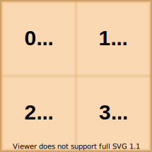
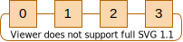

*************************************
Process-level Parallelism with MPI
*************************************

.. include:: /global.rst

.. namespace:: HIPP::MPI

.. _tutor-mpi-using-the-lib:

Using the Library 
=====================

The MPI Environment
--------------------

To use the MPI module of HIPP, include the header file ``<hippmpi.h>``. A minimal 
cpp source file is like::

    // mpi-minimal-example.cpp
    #include <hippmpi.h>                                    // [1]

    using namespace HIPP;
    using namespace std;
    namespace mpi = HIPP::MPI;                              // [2]

    int main(int argc, char *argv[]) {
        mpi::Env env(argc, argv);                           // [3]

        auto comm = env.world();                            // [4]
        int rank = comm.rank(), n_procs = comm.size();      // [5]
        
        pout << "Process ", rank, " among ", n_procs, endl;

        return 0;
    }

Debrief:

- ``[1]``: all the MPI components are declared within the header file ``<hippmpi.h>``.
- ``[2]``: the shortcut of the MPI namespace is defined. We adopt this namespace declaration throughout this tutorial.
- ``[3]``: the MPI environment is initialized, as if the standard ``MPI_Init()`` is called.
- ``[4]``: the global communicator is retrieved.
- ``[5]``: process meta-info are inquired through the communicator.

To compile and execute, run:

.. code-block:: bash

    mpicxx -std=c++17 mpi-minimal-example.cpp -lhippmpi -lhippcntl
    mpiexec -np 4 ./a.out

If the IO module is installed, you may have to link with ``-lhippio -lhdf5`` so that 
the parallel logger is enabled.

The output is like:

.. code-block:: text

    Process 0 among 4
    Process 2 among 4
    Process 1 among 4
    Process 3 among 4

.. _tutor-mpi-basic-p2p:

Point-to-Point Communications 
--------------------------------

To send a message from one process to another, call :expr:`Comm::send()` in
the sender process and call :expr:`Comm::recv()` in the receiver process. For 
example, we send a floating-point value::

    double x_send, x_recv;
    int tag = 0;
    if( rank == 0 ) {
        comm.send(1, tag, x_send);
    } else if( rank == 1 ) {
        comm.recv(0, tag, x_recv);
    }

The arguments of ``send`` or ``recv`` are the rank of the target process, the 
tag for message matching, and the data buffer.

Various types of buffer are supported, including numerical scalars (e.g., ``double``, ``int``),
raw arrays of such scalars (e.g., ``double [3]``, ``int [3][4]``), ``std::array`` of scalars, 
and ``std::vector`` of scalars. For example::

    int raw_arr[3][4];
    std::array<float, 3> arr;
    vector<double> vec(10);

    comm.send(1, tag, raw_arr);
    comm.send(1, tag, arr);
    comm.send(1, tag, vec);

More complicated buffer may be specified by ``address, count, datatype`` triplet, 
which is standard-compliant and therefore fully flexible. For example, the above 
``raw_arr`` may be sent by::

    comm.send(1, tag, &raw_arr[0][0], 12, mpi::INT);

Collective Communications
--------------------------------

A collective communication is performed by all processes in a communicator. 
The simplest collective call is :expr:`Comm::barrier()`::

    comm.barrier();

Other communication calls are used to transfer data. For example, :expr:`Comm::bcast()`
broadcasts a data buffer from one ``root`` process to the others::

    int root = 0;
    double buff[4];
    comm.bcast(buff, root);

:expr:`Comm::gather()` collects the same amount of data from each process and puts them 
contiguously into a buffer in the root::

    int data;
    if( rank == root ) {
        vector<int> buff(n_procs);
        comm.gather(data, buff, root);
    } else {
        comm.gather(data, {}, root);
    }

:expr:`Comm::gatherv()` futher allows different amount of data from processes. 
The root process must specify the ``counts`` of data items from processes and 
the ``displacements`` where they are put. 
The following codes collect one item from each process and then put them with 
a stride 2::

    if( rank == root ) {
        vector<int> buff(2*n_procs), counts(n_procs, 1), displs(n_procs);
        for(int i=0; i<n_procs; ++i) displs[i] = 2*i;
        comm.gatherv(data, buff, counts, displs, root);
    } else {
        comm.gatherv(data, {}, {}, {}, root);
    }

Collective computation calls combine the data transfer and computation. For example, 
:expr:`Comm::reduce()` reads the buffers from processes, applies a reduction 
operation element-wisely, and then puts the results into a buffer of the root::

    int total;
    comm.reduce(data, total, mpi::SUM, root);

HIPP supports the full set of collective calls. Refer to the API reference for 
details.

Datatypes
--------------------------------

MPI predefines a set of commonly used datatypes. Users may create new datatypes 
from the predefined ones. All datatypes are represented by 
:class:`Datatype` objects.

Most of the predefined datatypes correspond to the types in the C++:

.. table:: 
    :class: tight-table

    =================================================== ============================================
    C++ type                                            MPI Datatype Instance 
    =================================================== ============================================
    ``char``                                            :var:`CHAR`
    ``signed char``, ``unsigned char``                  :var:`SIGNED_CHAR`, :var:`UNSIGNED_CHAR`
    ``short``, ``unsigned short``                       :var:`SHORT`, :var:`UNSIGNED_SHORT`
    ``int``, ``unsigned int``                           :var:`INT`, :var:`UNSIGNED_INT`
    ``long``, ``unsigned long``                         :var:`LONG`, :var:`UNSIGNED_LONG`
    ``long long``, ``unsigned long long``               :var:`LLONG`, :var:`UNSIGNED_LLONG`
    ``float``, ``double``                               :var:`FLOAT`, :var:`DOUBLE`
    ``std::complex<float>``, ``std::complex<double>``   :var:`FLOAT_COMPLEX`, :var:`DOUBLE_COMPLEX`
    =================================================== ============================================

See the API-Ref :ref:`api-mpi-predefined-dtype` for the full list of predefined datatypes.

To use the predefined datatypes, just refer to the static variables. For example, 
to send 4 double-precision values, write::

    double buff[4];
    auto &dt = mpi::DOUBLE;    
    comm.send(1, tag, buff, 4, dt);

HIPP provides type mappings that convert C++ types (or their names) to the predefined MPI datatypes:

- :expr:`Datatype::from_type<T>()`: returns the datatype that corresponds to the C++ type ``T``.
- :expr:`Datatype::from_name(name)`: returns the datatype that corresponds to its ``name`` string.

For example, both of the following two calls return a reference to :expr:`DOUBLE`::

    auto &dt = mpi::Datatype::from_type<double>();
    auto &dt = mpi::Datatype::from_name("double");

Various methods of :class:`Datatype` are defined to create customized datatypes:

.. table::
    :class: tight-table

    =========================================================================== ==================================================================================================
    Method of :class:`Datatype`                                                 Description
    =========================================================================== ==================================================================================================
    :func:`~Datatype::contiguous`                                               ``count`` contiguously-layout elements.
    :func:`~Datatype::vector`, :func:`~Datatype::hvector`                       Generalization of ``contiguous`` - allow regular gaps between equal-size blocks of elements. 
    :func:`~Datatype::indexed_block`, :func:`~Datatype::hindexed_block`         More general - the gaps between equal-length blocks may be different.
    :func:`~Datatype::indexed`, :func:`~Datatype::hindexed`                     Both the gaps and block lengths may be different.
    :func:`~Datatype::struct_`                                                  Most general - the datatypes, lengths of blocks and the gaps may all be different.
    :func:`~Datatype::resized`                                                  Change the lower bound and extent.
    :func:`~Datatype::darray`                                                   A part of a distributed array.
    :func:`~Datatype::subarray`                                                 A sub-array of a array.
    =========================================================================== ==================================================================================================        

For example, to create a datatype that describes a row of a 4-by-4 matrix ``double mat[4][4]``, 
use :expr:`Datatype::contiguous()`. Then, this new datatype can be used in any communication call::

    auto dt_row = mpi::DOUBLE.contiguous(4);
    comm.bcast(&mat[0][0], 2, dt_row, root);        // Broadcast the first two rows.

It is slightly different to obtain the datatype that corresponds a column of such a matrix::

    int count = 4, blklen = 1, stride = 4;
    auto dt_col = mpi::DOUBLE.vector(count, blklen, stride).resized(0, sizeof(int));
    comm.bcast(&mat[0][0], 2, dt_col, root);        // Broadcast the first two columns.

To get a 2-by-2 sub-array of the matrix, write::

    int sizes[2] = {4,4}, subsizes[2] = {2,2}, starts[2] = {1, 1};
    auto dt_subarray = mpi::DOUBLE.subarray(sizes, subsizes, starts);
    comm.bcast(&mat[0][0], 1, dt_subarray, root);   // Broadcast a 2x2 sub-array.

See the API-Ref of :class:`Datatype` for a complete description of these methods.

Communicator Manipulation 
--------------------------------

Predefined Communicators 
""""""""""""""""""""""""""""

MPI predefines three communicators for the most common tasks:

- :expr:`Comm::selfval()`: returns a communicator that only contains the process itself.
- :expr:`Comm::nullval()`: returns a communicator that contains no process - it is an invalid argument 
  of communication calls.
- :expr:`Comm::world()`: returns the global communicator that contains all processes. :expr:`Env::world()`
  is identical to this call.

Create New Communicators
""""""""""""""""""""""""""""

To create a customized communicator, use one of the following calls:

- :expr:`Comm::split()`: splits a communicator into sub-communicators.
- :expr:`Comm::dup()`: copies an existing communicator.
- :expr:`Comm::create()`: creates a new communicator by specifying a group of processes.

:expr:`Comm::split(color)` splits a communicator according to the "colors" of caller processes and 
returns the new communicator which the caller belongs to.
Processes with the same color will be grouped into the same communicator.
For example, the following codes split ``comm`` into two that contain odd-ranked and even-ranked
processes, respectively::

    int color = rank % 2;
    auto mod2_comm = comm.split(color);
    pout << "Process ", rank, '/', n_procs, " in the new comm is ", 
        mod2_comm.rank(), '/', mod2_comm.size(), endl;

The output (run with 5 processes) is like:

.. code-block:: text

    Process 0/5 in the new comm is 0/3
    Process 1/5 in the new comm is 0/2
    Process 2/5 in the new comm is 1/3
    Process 3/5 in the new comm is 1/2
    Process 4/5 in the new comm is 2/3

:expr:`Comm::dup()` directly copies the caller communicator and returns the new one::

    auto copied_comm = comm.dup();

:expr:`Comm::create(group)` takes a :class:`Group` instance and
returns the new communicator that contains this group of processes. If the caller 
process does not belong to the group, the returned communicator is a null communicator.
This call is collective - all processes in the caller communicator must call 
this method with disjoint groups. Empty group may be used as argument if 
a process needs not to be contained in any of the new groups. The following 
codes create a new communicator containing the first two processes::

    auto grp = comm.group(),
        sub_grp = (rank < 2) ? grp.incl({0,1}) : grp.emptyval();
    auto sub_comm = comm.create(sub_grp);

Inter-communicator
""""""""""""""""""""

An inter-communicator involves two groups of processes. Point-to-point and 
collective calls have different semantics in an inter-communicator compared 
with those in the ordinary (namely, intra) communicator.

To create an inter-communicator, call :expr:`Comm::create_inter()` on the 
local communicator and pass the local leader, the peer-communicator, 
the remote leader, and a safe-tag to it. For example, use the above 
``mod2_comm``, we create an inter-communicator::

    int remote_leader = (rank % 2)? 0 : 1;
    auto inter_comm = mod2_comm.create_inter(0, comm, remote_leader, 0);

Method :expr:`Comm::merge_inter()` merges an inter-communicator into an ordinary 
communicator::

    auto merged_comm = inter_comm.merge_inter(rank % 2);

Meta-info Inquiry 
""""""""""""""""""""

MPI defines methods to inquiry the meta-info of a communicator:

- :expr:`Comm::rank()`: returns the rank of the caller process in the communicator.
- :expr:`Comm::size()`: returns the number of processes in the caller communicator.
- :expr:`Comm::group()`: returns the handler of the group (:expr:`Group` instance) that contains processes in the communicator.
- :expr:`Comm::is_null()`: tests whether the communicator is a null communicator.

Several methods are defined for inter-communicator:

- :expr:`Comm::is_inter()`: tests whether or not the communicator is an inter-communicator.
- :expr:`Comm::group()`, :expr:`Comm::rank()`, :expr:`Comm::size()`: return the local group, local rank, and local size, respectively.
- :expr:`Comm::remote_group()`, :expr:`Comm::remote_size()`: return the remote group and size, respectively.

Attribute Caching
""""""""""""""""""

MPI allows user to attach data on a communicator, 
so that the data have life-time as persistent as the communicator.

To attach data, first define a class for them. For example, the following
``class Attr`` has two data items ``x`` and ``y``::

    struct Attr {
        int x;
        double y;

        Attr(int _x, int _y) : x(_x), y(_y) {}
        
        Attr(const Attr &that) : x(that.x), y(that.y) {
            pout << "Attr is copied", endl;
        }
        
        ~Attr() {
            pout << "Attr is destroyed", endl;
        }
    };

The copy constructor is used when a communicator is copied. The destructor 
is used when an attribute is deleted.

Each attribute must have a key that identifies it. Those keys are usually
stored in static variables. To create a key for ``Attr``, write::

    static int keyval = mpi::Comm::create_keyval<Attr>();

Then, just create new attribute by ``new`` operator and attach it to a communicator::

    comm.set_attr(keyval, new Attr(1, 2.0));

To retrieve the data, call :expr:`Comm::get_attr()` with the key value that 
identifies the attribute::

    Attr *attr;
    comm.get_attr(keyval, attr);
    pout << "x=", attr->x, ", y=", attr->y, endl;

When a communicator is copied, its attributes are also copied. For example::

    auto copied_comm = comm.dup();
    if( copied_comm.get_attr(keyval, attr) ) {
        pout << "x=", attr->x, ", y=", attr->y, endl;
    } else {
        pout << "attr is not set", endl;
    }

When a communicator is destroyed, its attributes are also destroyed. You may also 
manually destroy an attribute by calling :expr:`Comm::del_attr()`::

    comm.del_attr(keyval);

The output from one of the processes is like:

.. code-block:: text

    x=1, y=2
    Attr is copied
    x=1, y=2
    Attr is destroyed
    Attr is destroyed

Virtual Topologies 
----------------------

Virtual topology in MPI defines logical links between pairs of processes in 
a group. Each process in the topology is called a "node" and each link is 
called a "edge". The whole topology is fully described by a graph, either 
undirected or directed. 

Virtual topology enables simplified communication calls for common communication 
patterns. It also allows the implementation to optimize the mapping of processes 
onto physical topology.

Virtual topology information is attached to the communicator in MPI. Therefore, 
a communicator with virtual topology may be used as a ordinary communicator 
with ordinary communication calls, or used as a virtual topology communicator 
with special calls for the corresponding topology type.

MPI defines three types of virtual topology, from restricted to general. The following
table lists the available topology types, the functions used to create them, and 
the functions used to retrieve their information. All the functions are methods
of class :class:`Comm`:

.. table:: 
    :class: tight-table

    =========================== =================================================== =====================================================
    Type of Topology            Creation Method                                     Meta-info Inquiry Method
    =========================== =================================================== =====================================================
    Cartesian                   :func:`~Comm::dims_create` |br|                     :func:`~Comm::cartdim_get` |br|
                                :func:`~Comm::cart_create` |br|                     :func:`~Comm::cart_get` |br|
                                :func:`~Comm::cart_sub`                             :func:`~Comm::cart_rank` |br|
                                                                                    :func:`~Comm::cart_coords` |br|
                                                                                    :func:`~Comm::cart_shift`
    Graph                       :func:`~Comm::graph_create` |br|                    :func:`~Comm::graphdims_get` |br|
                                                                                    :func:`~Comm::graph_get` |br|
                                                                                    :func:`~Comm::graph_neighbors_count` |br|
                                                                                    :func:`~Comm::graph_neighbors`
    Distributed Graph           :func:`~Comm::dist_graph_create_adjacent` |br|      :func:`~Comm::dist_graph_neighbors_count` |br|
                                :func:`~Comm::dist_graph_create` |br|               :func:`~Comm::dist_graph_neighbors`
    =========================== =================================================== =====================================================

A Cartesian topology logically assigns processes onto a regular grid. The method :expr:`Comm::dims_create()`
is a helper function that determines the number of processes at each dimension (``dims``)
given the total number of processes and the number of dimensions (``ndims``). Once the process layout 
is determined, :expr:`Comm::cart_create()` is used to create the Cartesian topology and returns the new 
communicator with topology information attached. Processes are row-majorly assigned to the grid points.
The argument ``periods`` specifies whether or not each dimensions is periodic.

For example, we have 4 processes in the communicator 
and we assign them to a :math:`2 \times 2` grid. To logical layout is like the following :numref:`fig-tutor-mpi-two-by-two-cart-topo`:

.. _fig-tutor-mpi-two-by-two-cart-topo:

    The Cartesian virtual topology with 4 processes on a :math:`2 \times 2` grid. Each cell 
    represents a process with rank and Cartesian coordinates indicated.

The code to create such a topology is::

    int dims[2] = {2,2}, periods[2] = {1,1};
    auto cart = comm.cart_create(dims, periods);

From the communicator ``cart``,  we may inquiry the rank, the coordinates, 
and the ranks of neighbors of a given process::

    int rank = cart.rank();
    auto coords = cart.cart_coords(rank);
    auto [top, bottom] = cart.cart_shift(0);
    auto [left, right] = cart.cart_shift(1);

    pout << "Process ", rank, " is at coordinates (", coords, 
        ") with neighbors {", left, ", ", right, 
        ", ", top, " and ", bottom, "}", endl;

The output run with 4 processes is:

.. code-block:: text

    Process 0 is at coordinates (0,0) with neighbors {1, 1, 2 and 2}
    Process 1 is at coordinates (0,1) with neighbors {0, 0, 3 and 3}
    Process 2 is at coordinates (1,0) with neighbors {3, 3, 0 and 0}
    Process 3 is at coordinates (1,1) with neighbors {2, 2, 1 and 1}

A Graph topology is an undirected graph, which is fully described by an adjacent matrix.
The adjacent matrix needs not to be symmetric, but neighbor collective calls and 
full optimization may be only available in the symmetric case.

To create a Graph topology, call :expr:`Comm::graph_create(nnodes, index, edges)`, where 
``nnodes`` specifies the number of nodes; ``index`` is a buffer sized ``nnodes`` 
and ``index[i]`` is the total number of degrees of all nodes with node number ``<=i``; 
``edges`` is a buffer that contiguously stores the neighbor node numbers of each node.
All processes must pass the same arguments that fully describe the graph.

For example, we create an 1-D ring topology for 4 processes shown as the following 
:numref:`fig-tutor-mpi-np4-ring-topo`:

.. _fig-tutor-mpi-np4-ring-topo:

    The 1-D ring topology with 4 processes. In each cell, the number denotes 
    the process rank (namely, the node number).

The code to create such a topology is::

    int nnodes = 4, index[4] = {2, 4, 6, 8}, 
        edges[8] = {3, 1, 0, 2, 1, 3, 2, 0};
    auto graph = comm.graph_create(nnodes, index, edges);

Method :expr:`Comm::graph_neighbors(rank)` returns the neighbor node numbers of a given 
node numbered ``rank`` in a Graph topology::

    int rank = graph.rank();
    auto ngbs = graph.graph_neighbors(rank);
    pout << "Process ", rank, " has neighbors {", ngbs, "}", endl;

The output (run with 4 processes) is:

.. code-block:: text

    Process 0 has neighbors {3,1}
    Process 1 has neighbors {0,2}
    Process 2 has neighbors {1,3}
    Process 3 has neighbors {2,0}

Distributed Graph topology is an extension of Graph topology. The construction 
arguments are distributed among processes, i.e., to create the graph, 
each process specifies only a part of all edges. 
This enables more scalable applications than Graph topology.

A Distributed Graph topology is a directed graph. To create, each 
process specifies a set of possible edges, which may or may not link to this 
process. For example, to create an 1-D ring topology, each process may specify
two outgoing edges to the two neighbors::

    int rank = comm.rank(), n_procs = comm.size(),
        left = (rank - 1 + n_procs) % n_procs, right = (rank + 1) % n_procs;

    int srcs[1] = {rank}, degrees[1] = {2}, dsts[2] = {left, right}, 
        reorder = 0;
    auto dgraph = comm.dist_graph_create(srcs, degrees, dsts, 
        mpi::Info::nullval(), reorder);

Method :expr:`Comm::dist_graph_neighbors()` returns the sources 
(of all in-coming edges) and the destinations (of all outgoing edges) of 
the caller process in a Distributed Graph topology::

    auto [ngb_srcs, ngb_dsts] = dgraph.dist_graph_neighbors();
    pout << "Process ", rank, " has incoming neighbors {" , ngb_srcs, "} "
        "and outgoing neighbors {", ngb_dsts, "}", endl;

The output (run with 4 processes) is:

.. code-block:: text

    Process 0 has incoming neighbors {1,3} and outgoing neighbors {3,1}
    Process 1 has incoming neighbors {0,2} and outgoing neighbors {0,2}
    Process 2 has incoming neighbors {1,3} and outgoing neighbors {1,3}
    Process 3 has incoming neighbors {0,2} and outgoing neighbors {2,0}

Once a topology is defined, neighbor collective calls are used to transfer 
data from/to neighbors of each process. 

For example, method 
:expr:`Comm::neighbor_allgather()` allows each process to 
send a buffer to all its neighbors and receive the buffers sent by the neighbors.
In the above Distributed graph, 
the sending destinations are defined by outgoing edges and the receiving sources 
are defined by in-coming edges. We send the rank of each process to its two 
neighbors by::

    int send_data = rank, recv_buff[2];
    dgraph.neighbor_allgather(send_data, recv_buff);
    pout << "Process ", rank, " gathered {", 
        pout(recv_buff, recv_buff+2), "}", endl;

The output (run with 4 processes) is:

.. code-block:: text

    Process 0 gathered {1,3}
    Process 1 gathered {0,2}
    Process 2 gathered {1,3}
    Process 3 gathered {0,2}

For the complete set of neighbor collective calls, see the API-Ref 
:ref:`Neighbor Collective Communications <api-mpi-comm-virtual-topology-ngb-collective>`.

Basic Usage 
--------------

.. toctree:: 
    :maxdepth: 2

    basic_usage/simple_communication
    basic_usage/datatype
    basic_usage/comm
    basic_usage/one_side
    basic_usage/file_io

Advanced Topics 
----------------

.. toctree::
    :maxdepth: 2

    advanced/mpi-env
    advanced/point-to-point
    advanced/inter

Example Codes Gallery
-----------------------

.. table::
    :class:     fix-width-table tight-table
    :widths:    30 30 40

    =========================================================================== ========================================================================================================================= ==============================================================================================
    Topic                                                                       Codes                                                                                                                     Description
    =========================================================================== ========================================================================================================================= ==============================================================================================
    :ref:`tutor-mpi-env`                                                        :download:`get-started.cpp </../example/tutorial/mpi/get-started.cpp>`                                                    Use :class:`~HIPP::MPI::Env` to start the MPI environment.
    :ref:`tutor-mpi-p2p`                                                        :download:`basic-p2p.cpp </../example/tutorial/mpi/basic-p2p.cpp>`                                                        Use :class:`~HIPP::MPI::Comm` to send/recv data.
    :ref:`tutor-mpi-collective`                                                 :download:`basic-collective.cpp </../example/tutorial/mpi/basic-collective.cpp>`                                          Use :class:`~HIPP::MPI::Comm` for collective data movement and computation.
    :ref:`tutor-app-distributed-sum`                                            :download:`app-distributed-sum.cpp </../example/tutorial/mpi/app-distributed-sum.cpp>`                                    Example: use :func:`~HIPP::MPI::Comm::scatter` and :func:`~HIPP::MPI::Comm::reduce` for 
                                                                                                                                                                                                          task decomposition and result reduction.
    :ref:`tutor-app-pi-computation`                                             :download:`app-pi-computation.cpp </../example/tutorial/mpi/app-pi-computation.cpp>`                                      Example: approximate :math:`\pi` with numerical integration.
    :ref:`tutor-app-matrix-vec-dot`                                             :download:`app-matrix-vec-dot.cpp </../example/tutorial/mpi/app-matrix-vec-dot.cpp>`                                      Example: matrix-vector multiplication :math:`c=A\times b` with self-scheduling.
    :ref:`tutor-example-comm-subset-communication`                              :download:`comm-subset-communication.cpp </../example/tutorial/mpi/comm-subset-communication.cpp>`                        Example: group communication within a subset of processes
    =========================================================================== ========================================================================================================================= ==============================================================================================

