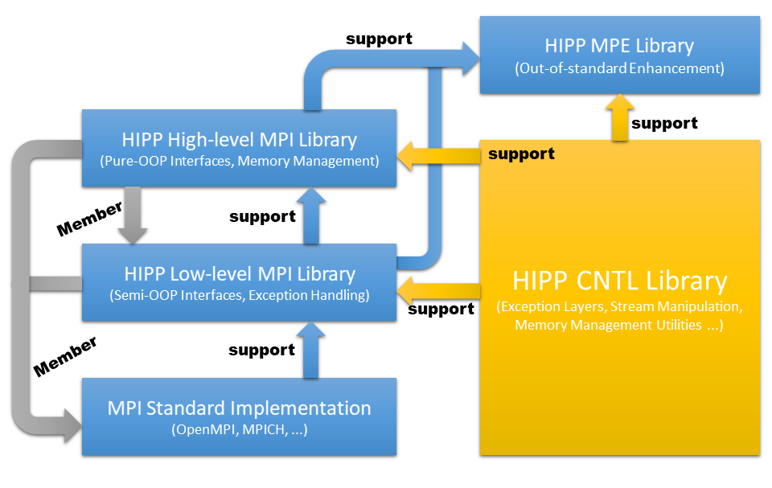

# Begin with HIPP MPI Module

## What is HIPP MPI ?

HIPP has a MPI module that provides the high-level OOP wrappers of standard MPI C library. The characteristics of HIPP MPI are

* Built with abstract layers: One of the most powerful idea in computer science is the abstraction. Complicated systems are often designed to have multiple layers. The high-level layers hidding their interaction with low-level layers and providing convinient interface to users that do not care about the implementation detail. The low-level layers allow advanced users to deal with more subtle cases.  HIPP MPI is designed to have four layers. We will introduce this design at [The User's Guide](../../users-guide.md) in detail.



* Pure OOP interface: Only by using OOP programming you can build safe program. Also, the OOP style allows you write your program faster, without much care about the memory leak. See the [Fun With Data Type](fun-with-data-types.md) for an example of OOP-style data types creation.
* Maximum flexibility: Thanks for the C++ meta-programmings, HIPP MPI is very flexible. For one thing HIPP MPI may provide many different ways of achieving the same goal. You may always use the standard-MPI-like way of making message passing \(which allows a MPI user easily switch to HIPP MPI\), and you may also sometimes use the non-standard way for clarity. See the [Basic Point-to-point Communication](basic-point-to-point-communication.md) for an example.
* Common case simpler: HIPP tries to make the common case user-friend, suitable for the majority of workds. The full interfaces are also provided to deal with the un-common case. 
* Complete Implementation: Some high-level wrapper libraries cannot implement the full MPI library since their design drawbacks. HIPP MPI is designed to be capable for wrapping all MPI subroutines.

## The 'Hello World' Example


**Caution:** In the following we assume you have already known the basic ideas of standard MPI interface, such as the initialization and finalization of MPI environment \( MPI\_Init\(\) and MPI\_Finalize\(\) \), the basic point-to-point communication \( MPI\_Send\(\) and MPI\_Recv\(\) \). If you a new to MPI, this tutorial is not suitable for you. We recommend you to learn at least the basic ideas of how to use standard MPI. Some tutorial material can be found at the [MPI Tutorial](https://mpitutorial.com/tutorials/).

We also assume that you have already install successfully the HIPP with MPI library enabled. If  not, please see the the [home page](../../../) for how to install HIPP with MPI option.


We begin with the 'hello world' example as a demonstration of how to use HIPP MPI \(the source code can be found at the example/mpi directory in the repo\).

```bash
#include <hippmpi.h>
using namespace std;

int main(int argc, char *argv[]){
    HIPP::MPI::Env env;          // [1] init the MPI environment
    auto comm = env.world();     // [2] obtain the communicator 

    // [3] print environment and commnicator information
    HIPP::prt(cout, "Hello world from processor ", env.processor_name(),
        ", rank ", comm.rank(), 
        " out of ", comm.size(), " processors") << endl;
    return 0;
}
```

First to notice is the header file `<hippmpi.h>`, which is the only header file that needs to be included in all HIPP MPI interfaces. Some standard library of C++ is also automatically included once &lt;hippmpi.h&gt; is included, so that you can do using the `std` namespace \(altough this is always not recommended, we will expose the standard namespace throughout this tutorial for clarity\).

The second thing is the namespace `HIPP::MPI` where all HIPP MPI class, subroutines and static variable definitions live, such as the Env class you see here. The outer namespace `HIPP` is all HIPP CNTL definitions live \(see the tutorial of the [CNTL module](../begin-with-hipp-cntl-module.md)\), such as the prt\( \) function here.

Almost at the beginning of every standard MPI program, MPI\_Init\(\) should be called. In the HIPP MPI, the only thing you need to do is to declare an environment variable of class HIPP::MPI::Env at step \[1\]. In the construction of the `Env` object, the initialization of MPI is finished, just as you call a MPI\_Init\( \). It is also possible to pass arguments into the Env object like what you pass to MPI\_Init\(\), then the Env should be constructed with `HIPP::MPI::Env env(argc, argv)`. Note that there is not any counterpart to MPI\_Finalize\( \), because at the return of the main\( \), when Env object is deconstrcuted, the finalization procedure is automatically called.

Next you need a communicator which defines the context of the message passing. In the standard MPI you have MPI\_COMM\_WORLD, but here in the HIPP MPI you can get the predefined 'world' communicator by `env.world()` method at \[2\], which is of class HIPP::MPI::Comm and we use 'auto' key word to let the compiler infer its type automatically.

In the next step \[3\], you can inquire the information of the MPI environment and communicator. For example, you may use `env.processor_name()` to get your processor name, `comm.rank()` and `comm.size()` to get the rank of process in the communicator and the size of process group of the communicator. The `HIPP::prt()` function is just a printing function, accepting an stream to print to and any number of arguments to be printed.

### Compile and Run

Now you can compile and run the program. For example at an Unix-like shell, you call mpicxx -o hello\_world hello\_world.cpp -lhippmpi -lhippcntl; mpirun -n 4 ./hello\_world. These compile and run you program with 4 processors. In the output device it may print

```text
Hello world from processor local-linux, rank 0 out of 4 processors
Hello world from processor local-linux, rank 1 out of 4 processors
Hello world from processor local-linux, rank 2 out of 4 processors
Hello world from processor local-linux, rank 3 out of 4 processors
```

The exact result depends on which platform you run, and the result output from different processes may entangled.

The Env class API and Comm class API that have been used can be summarize as follows:

```cpp
// hippmpi.h
class Env{
public:
    /**
     * constructors - initialize MPI environment.
     * Without argument, it calls MPI_Init(NULL, NULL);
     * With arguments, it calls MPI_Init(&argc, &argv).
     * @argc, argv:  should be exactly those passed to main().
     */
    Env();
    Env(int &argc, char **&argv );
    /**
     * inquire the processor name and global communicator.
     */
    static string processor_name();
    static Comm world() noexcept;
};

class Comm: {
public:
    /**
     * get the size of process group in the communicator, and the rank of
     * the current process in this communicator.
     */
    int size() const;
    int rank() const;
};
```

Now you can equip you program with HIPP MPI. As you see, the OOP interface is really simple. What's more, it is the base to write a safe C++ program. Now you can move to [Basic Point-to-point Communication](basic-point-to-point-communication.md) to see how the pass the message.


**Elaboration:** note that all the class in HIPP MPI manages their internal MPI objects automatically \(e.g. The Comm class we introduced above\). All the resources will be released automatically after the deconstruction of the class instance. 

Also, they can be copy-constructed, copy-assigned, move-constructed, move-assigned. Once copy-constructed or copy-assigned, the new object refers to the same internal MPI object as the old. Once move-constructed or move-assigned, the new object refers to the internal MPI object originally in the old object, and the old object can no longer be used.

The only exception is the Env class. Which must be called exactly once, and cannot be copied or moved. If you want to pass it to other functions other than main\(\), you may construct the Env object with a new operator and use a std::shared\_ptr to take over it.


