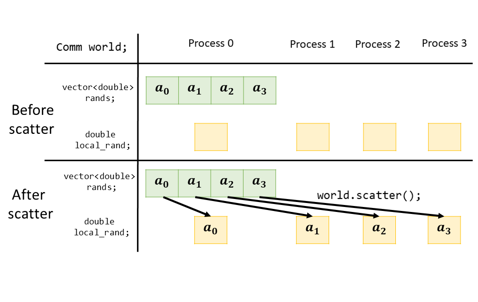

# Collective Communication

Standard MPI provides collective communication to allow data movement or computation among more than 2 processes using only one function call at each process. Compared with the point-to-point communications, the collective operations may save some memory and also allow faster implementation and optimization at both build time and run time for specific hardwares. HIPP MPI also supports the full interfaces of the collection operations. This example demonstrate how to make collective data movement  with the 'sctter' subroutine, and make collective computation using the 'reduce' subroutine. A full list of the supported collective operations can be found at the [User's Guide](../../users-guide.md).


**Caution:** In MPI a collective operation always involves all the processes of a group in a communicator. It is users' responsibility to make sure all the processes in the communicator call the collective subroutines at the same order, otherwise deadlock or more subtle fault may ruin the program.


## Collective Data Movement

We begin with an example showing how to move data among processes using only one function call at each process. In MPI, various data movement subroutines are defined for users' convinience, including the one-to-all communication, all-to-one communication and all-to-all communication, and other variants. Here we demonstrate a one-to-all operation, called 'scatter', that move data from one process to any other process in the same communicator.

This type of task is usually needed. Sometimes you build a client-server \(or master-slave\) model with one server process and multiple client processes. You may need to distribute some data associated with each process. A common case is a parallel random number generator: since most random number generators are developed to run at a sequential code, so it is safe to generate some random numbers in one process and distribute them into different process. A pure parallel random number generator is beyond the scope of this tutorial, and here we choose to do so, just as an example to demonstrate the collective operation in MPI.

Like previous we first initialize the environment by declare a HIPP::MPI::Env object, and get the communicator world through it. Then we write the following code to generate some random numbers

```cpp
#include <hippmpi.h>
using namespace std;

HIPP::MPI::Env env;
auto world = env.world();

vector<double> rands;
if( world.rank() == 0 ){
    for(int i=0; i<world.size(); ++i)
        rands.push_back(i);
    shuffle( rands.begin(), rands.end(),  // [1] here we use std::shuffle()
        default_random_engine() );        // to make the vector randomized.
    HIPP::prt(cout, "Random numbers are: ");
    HIPP::prt_a(cout, rands) << endl;
}
```

Thereafter the rank-0 process has a vector consisting of a shuffled floating-point sequence, whose length is exactly the number of processes in the communicator. Now we want to distribute these numbers into other processes, each with one number \(including the rank-0 process itself\). This can be easily done by calling `scatter` method of the communicator instance

```cpp
double local_rand;
world.scatter( rands.data(), 1, HIPP::MPI::DOUBLE,
    &local_rand, 1, HIPP::MPI::DOUBLE, 0);
```

In above each process declares a local buffer 'local\_rand', and calls 'world.scatter\(\)'. The scatter call should be passed with 7 arguments, the first 3 arguments are &lt;sendbuf, sendcount, sendtype&gt; triplet that determines the buffer which the data is sent from and is only significant at the sender process \(which is a double variable in this example\). The following 3 arguments are &lt;recvbuf, recvcount, recvtype&gt; that determine the buffer which the data is sent to \(which is also a double variable in this example\), and all must match the send buffer type map. The final argument is the sender process's rank, which is 0 in this example.


**Elaboration:** You may find it is strange that the send triplet specify a 'sendcount=1'. This is just the choice of MPI standard: the 'sendcount' means the number of data items sending to each process \(including the sender itself\) but NOT the number of data items sending to all processes.



**Elaboration:** In HIPP MPI, the data buffer specification in the collective operations are not as flexible as in the point-to-point operations. The data buffer address, the data item count and the datatype must be explicitly specified, and the datatype must be pre-defined Datatype object, e.g. DOUBLE, INT, ..., or a derived Datatype object. The complet list of supported pre-defined Datatype object can be found at the [User's Guide](../../users-guide.md).


The data movement  of 'scatter' can be illustrated with the following figure. Before the 'scatter' call, each prosses's local\_rand buffer is un-initialized. After the 'scatter' call, data in the rank-0 process's  'rands' buffer is distributed into all processes in the communicator.



## Collective Computation

