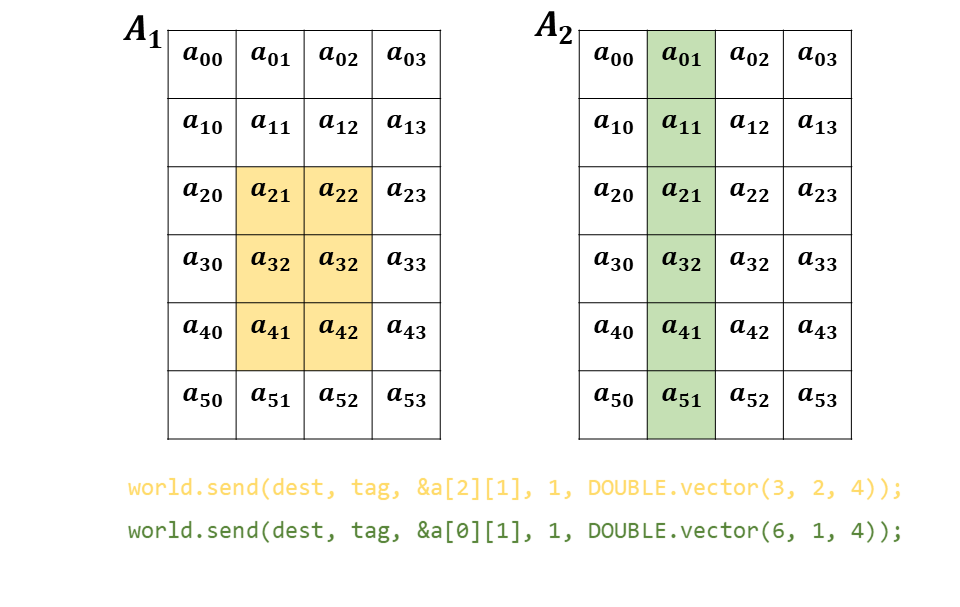

# Fun with Data Types


## The Vector Datatype

Vector datatype is used to represent equal-length, regular-stride, non-contigous blocks of some primary datatype. For example, if we define a C-style 2-dimensional array, such as `double a[6][4]`, the vector datatype may be used to represent a block of it.

The following example shows two possible block of matrix `a`. In the left panel, the orange shading represents a 3x2 slice of the matrix. In the right panel, the green shading represents a 6x1 slice of the matrix, which is the second column of the matrix.



In the massage passing, there are different ways to send such a block of a matrix to other processes. For example, if we want to send the above 3x2 matrix, it is possible to call send multiple times, each time sending a contiguous part

```cpp
for(int i=2; i<5; ++i) world.send( dest, tag, &a[i][1], 2, "double" );
```

The receiver process can receive multiple times correspondingly. Yet another way is to first collect all the separate part into a contiguous buffer, and send the buffer once

```cpp
double buff[3][2];
for(int i=2; i<5; ++i) std::copy(&a[i][1], &a[i][3], buff[i-2]);
world.send( dest, tag, buff[0], 2*3, "double" );
```

Sometimes these techniques could be useful, but in many cases they are not good enough. For example, if number of rows in the block is so large, the multiple-send method will have much overhead, since in the MPI standard each message must have separate internal envelop and must be posted and recived separatly so that is will not be interfered by other messages. In other case, if the block is too large, the collecting-buffer technique is not suitable because it may consume much memory.

The MPI committee decides to support the user-defined datatypes, which must be derived from the basic pre-defined datatype or other user-defined datatypes. In this example, the vector datatype is best suitable, and we decribe how to use it with the standard MPI interface and the HIPP MPI interface.

To send the 3x2 block, you need first define a vector datatype that describe the block shape. This includes the number of non-continuous sub-block, the size of each sub-block, and the stride between two sub-blocks. In the standard MPI interface, you may write

```cpp
int count=3, blocklength=2, stride=4;
MPI_Datatype blocktype;
MPI_Type_vector(count, blocklength, stride, MPI_DOUBLE, &blocktype);
MPI_Type_commit(&blocktype);
MPI_Send(&a[2][1], 1, blocktype, dest, tag, MPI_COMM_WORLD);
MPI_Type_free(&blocktype);
```

In the receive process, you may also define the vector type and receive it in a block of a large matrix, or receive it just in a contiguous buffer. Do not forget to commit the user-created datatype before use it in the message passing, and do not forget to free it after finishing using.

In the HIPP MPI, these steps become simpler, and you may finish it in just one line of code:

```cpp
world.send(dest, tag, &a[2][1], 1, 
    HIPP::MPI::DOUBLE.vector(count, blocklength, stride));
```

Here what you did is putting the derived datatype \(from HIPP::MPI::DOUBLE\) at the datatype argument of the send call. You no longer need the troublesome commit and free steps. If you want to send a column of a matrix, the call is much similar. We summarize the calls in the Figure 1 above.

## Example: Matrix Transposition

As a demonstration of the power of derived datatype, we give a complete example as follow. We defined a 4x5 matrix, and want to use derived datatype to transpose it. In the process 0, it first initialize the the matrix conten \(the content at i-th row is just i\), and then define a column `col_type`. This data type represents a column of the matrix. 

However, in the MPI standard, the extent of a vector datatype is from its first element to its last element, so in this case it is 3x5+1=16. If you want to send multiple columns at one send call, the offset between adjacent vector datatype needs to be adjusted to 1, so that the starting point of the next column is 1-element offset, horizontally from the previous column. These can be done through the `resized` operation.

Finally you just send all the columns by one send call. The receiver process needs to do nothing but just receive the message continuous, row-majored into the matrix buffer with suitable shape \(5x4 in this example\). 

```cpp
#include <hippmpi.h>
#include <unistd.h>


int main(int argc, char const *argv[]){
    HIPP::MPI::Env env;
    const int nrow = 4, ncol = 5;
    double matrix[nrow][ncol], matrix_T[ncol][nrow];
    auto world = env.world();

    /**
     * use derived datatype and point-to-point communication to perform 
     * matrix transportation.
     * 
     * The rank-0 process initialize the original matrix, create derived
     * datatype and send the matrix with derived datatype.
     * 
     * The rank-1 process received the transposed matrix with pre-defined
     * datatype, and print it.
     */
    if( world.rank() == 0 ){
        for(int i=0; i<nrow; ++i)
            for(int j=0; j<ncol; ++j)
                matrix[i][j] = i;
        auto col_type = 
            HIPP::MPI::DOUBLE.vector(nrow,1,ncol).resized( 0,sizeof(double) );
        world.send( 1, 0, matrix[0], ncol, col_type );
    }else if( world.rank() == 1 ){
        world.recv( 0, 0, matrix_T[0], ncol*nrow, "double" );
        for(int i=0; i<ncol; ++i){
            for(int j=0; j<nrow; ++j)
                printf("%f\t", matrix_T[i][j]);
            printf("\n");
        }
    }

    return 0;
}

```

Now we print the data and you may find it is already transposed. The output is shown below. You may find the 4x5 matrix now is transposed into a 5x4 matrix, and the content at j-th column is j.

```cpp
0.000000        1.000000        2.000000        3.000000
0.000000        1.000000        2.000000        3.000000
0.000000        1.000000        2.000000        3.000000
0.000000        1.000000        2.000000        3.000000
0.000000        1.000000        2.000000        3.000000
```

The interfaces we have used can be summarized as follows. The Datatype::vector method creates and new vector datatype instance with the element datatype being the current instance. The Datatype::resized method creates a new datatype with given lower bound and extent.

```cpp
// hippmpi.h
class Datatype{
public:
    /**
     * create a vector datatype, consisting of `count` blocks, each with
     * `blklen` contiguous elements, with stride `stride`.
     */
    Datatype vector( int count, int blklen, int stride ) const;
    /**
     * reset the lower bound `lb` and extent `ext` of the datatype.
     */
    Datatype resized( aint_t lb, aint_t ext ) const;
};

// All MPI standard pre-defined datatypes have HIPP MPI counterpart.
extern const Datatype DOUBLE;
extern const Datatype INT;
extern const Datatype LONG;
extern const Datatype BYTE;
// ... ...
```


